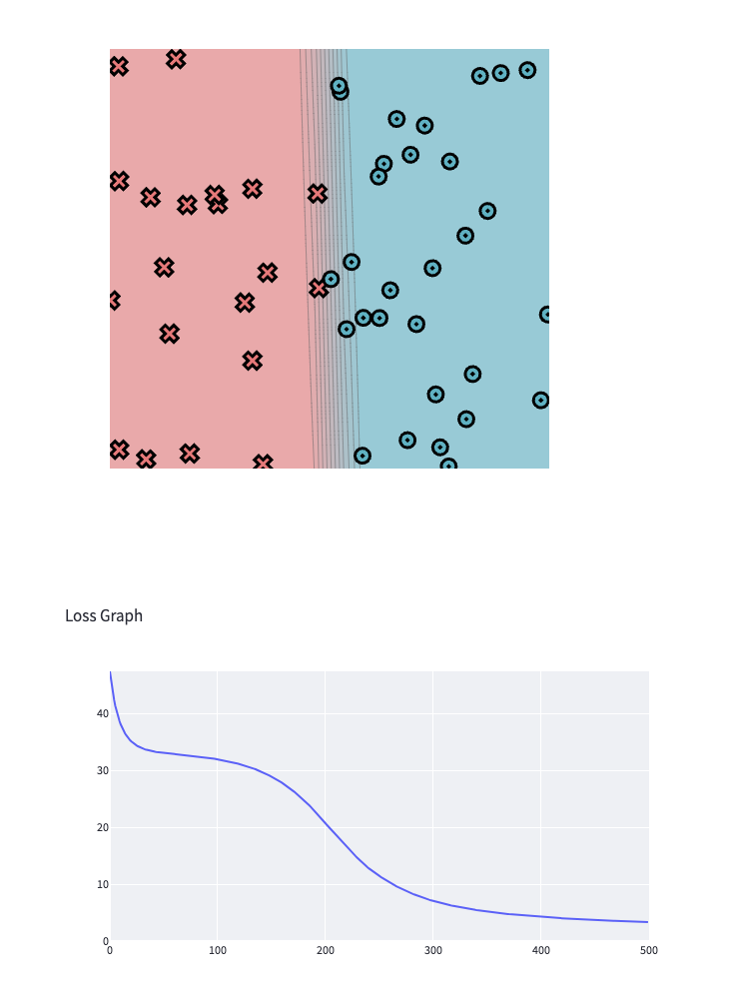
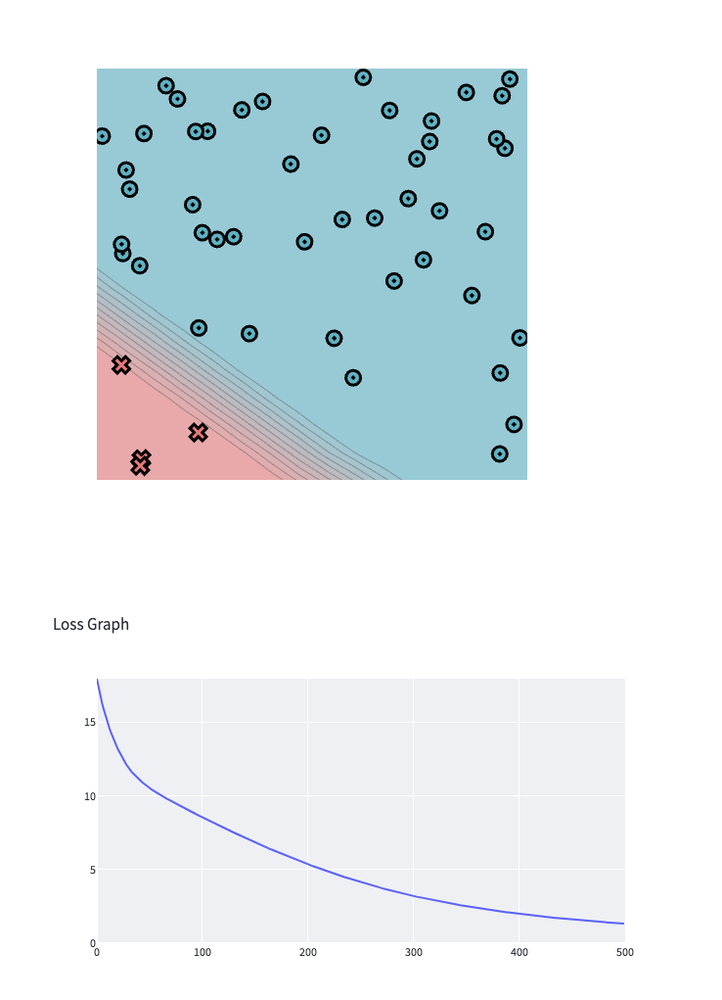
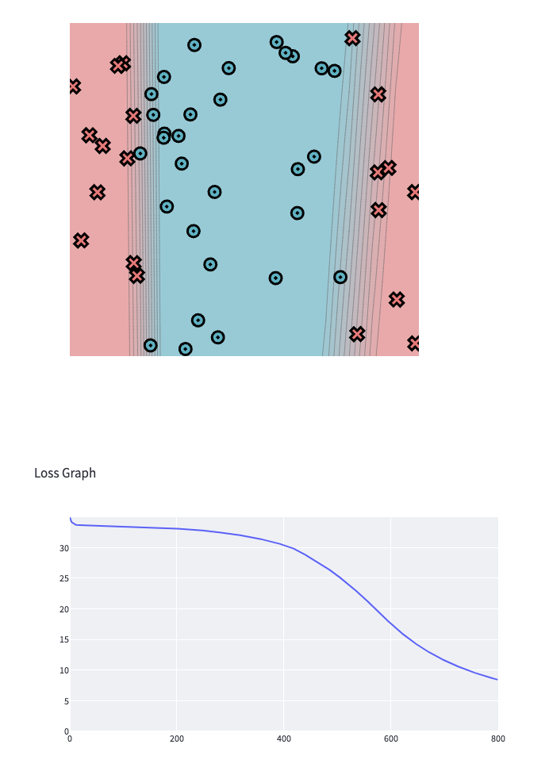
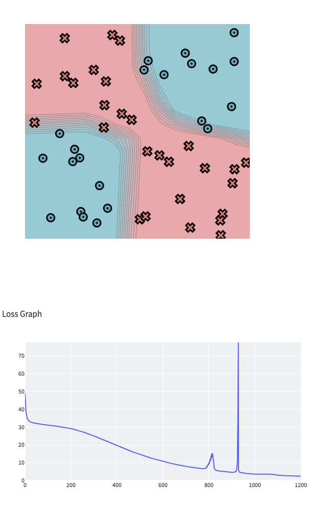

[](https://classroom.github.com/a/YFgwt0yY)
# MiniTorch Module 2


* Docs: https://minitorch.github.io/

* Overview: https://minitorch.github.io/module2/module2/

This assignment requires the following files from the previous assignments. You can get these by running

```bash
python sync_previous_module.py previous-module-dir current-module-dir
```

The files that will be synced are:

        minitorch/operators.py minitorch/module.py minitorch/autodiff.py minitorch/scalar.py minitorch/scalar_functions.py minitorch/module.py project/run_manual.py project/run_scalar.py project/datasets.py


\\Time per epoch: 0.054s. 


                [0.00 -0.02 -0.10]]
        [
                [0.00 0.00 0.00]]
        [
                [0.00 0.00 0.00]]
        [
                [0.00 0.00 0.00]]
        [
                [0.00 0.00 0.00]]
        [
                [0.00 -0.00 -0.00]]
        [
                [0.00 0.00 0.00]]
        [
                [0.00 -0.00 -0.00]]
        [
                [0.00 0.00 0.00]]
        [
                [0.00 0.01 0.03]]
        [
                [0.00 -0.00 -0.01]]
        [
                [0.00 -0.00 -0.00]]
        [
                [0.00 -0.00 -0.01]]
        [
                [-0.00 -0.00 -0.00]]
        [
                [0.00 0.01 0.06]]
        [
                [-0.00 -0.00 -0.00]]
        [
                [0.00 -0.00 -0.00]]
        [
                [0.00 -0.00 -0.00]]
        [
                [0.00 -0.00 -0.00]]
        [
                [0.00 -0.00 -0.01]]
        [
                [0.00 0.00 0.01]]
        [
                [0.00 0.00 0.00]]
        [
                [0.00 0.00 0.01]]
        [
                [0.00 0.00 0.00]]
        [
                [0.00 -0.00 -0.01]]
        [
                [0.00 0.00 0.00]]
        [
                [0.00 0.01 0.03]]
        [
                [0.00 0.00 0.00]]
        [
                [0.00 -0.02 -0.11]]
        [
                [0.00 0.00 0.00]]
        [
                [0.00 0.00 0.00]]
        [
                [0.00 -0.00 -0.00]]
        [
                [0.00 0.00 0.01]]
        [
                [0.00 -0.00 -0.00]]
        [
                [0.00 -0.00 -0.00]]
        [
                [0.00 -0.00 0.00]]
        [
                [0.00 0.00 0.00]]],)
[
[
        [
                [-0.42 -0.63 -1.27]]
        [
                [-0.12 -0.20 0.01]]
        [
                [-0.53 -0.80 -1.44]]
        [
                [-0.57 -0.87 -1.50]]
        [
                [-0.30 -0.43 -1.35]]
        [
                [-0.36 -0.58 -0.32]]
        [
                [-0.36 -0.52 -1.59]]
        [
                [-0.43 -0.62 -1.74]]
        [
                [-0.60 -0.91 -1.65]]
        [
                [-0.45 -0.64 -1.90]]
        [
                [-0.61 -0.89 -2.33]]
        [
                [-0.37 -0.55 -1.25]]
        [
                [-0.29 -0.48 -0.01]]
        [
                [-0.37 -0.55 -1.10]]
        [
                [-0.45 -0.67 -1.63]]
        [
                [-0.45 -0.66 -1.48]]
        [
                [-0.57 -0.85 -1.58]]
        [
                [-0.62 -0.91 -2.00]]
        [
                [-0.20 -0.32 -0.27]]
        [
                [-0.39 -0.56 -1.81]]
        [
                [-0.27 -0.43 -0.39]]
        [
                [-0.51 -0.76 -1.71]]
        [
                [-0.53 -0.81 -1.20]]
        [
                [-0.24 -0.36 -0.75]]
        [
                [-0.21 -0.35 -0.02]]
        [
                [-0.36 -0.56 -0.74]]
        [
                [-0.05 -0.07 -0.19]]
        [
                [-0.39 -0.58 -1.16]]
        [
                [-0.02 -0.04 -0.05]]
        [
                [-0.31 -0.48 -0.55]]
        [
                [-0.27 -0.41 -0.71]]
        [
                [-0.16 -0.25 -0.31]]
        [
                [-0.32 -0.48 -0.83]]
        [
                [-0.40 -0.59 -1.34]]
        [
                [-0.73 -1.10 -2.05]]
        [
                [-0.42 -0.61 -1.43]]
        [
                [-0.70 -1.06 -1.94]]
        [
                [-0.18 -0.25 -0.82]]
        [
                [-0.61 -0.91 -1.79]]
        [
                [-0.53 -0.82 -1.19]]
        [
                [-0.48 -0.70 -1.93]]
        [
                [-0.43 -0.66 -1.09]]
        [
                [-0.76 -1.14 -2.20]]
        [
                [-0.40 -0.56 -1.76]]
        [
                [-0.10 -0.15 -0.43]]
        [
                [-0.51 -0.78 -1.41]]
        [
                [-0.31 -0.49 -0.54]]
        [
                [-0.24 -0.38 -0.19]]
        [
                [-0.55 -0.78 -2.30]]
        [
                [-0.57 -0.85 -1.88]]]]
(
[
        [
                [0.00 0.01 0.02]]
        [
                [0.00 -0.00 -0.00]]
        [
                [0.00 0.00 0.00]]
        [
                [0.00 0.00 0.00]]
        [
                [0.00 0.00 0.02]]
        [
                [0.00 -0.00 -0.00]]
        [
                [0.00 0.00 0.00]]
        [
                [0.00 0.00 0.00]]
        [
                [0.00 0.00 0.00]]
        [
                [0.00 0.00 0.00]]
        [
                [0.00 0.00 0.00]]
        [
                [0.00 0.01 0.03]]
        [
                [0.00 -0.00 -0.00]]
        [
                [0.00 -0.02 -0.10]]
        [
                [0.00 0.00 0.00]]
        [
                [0.00 0.00 0.00]]
        [
                [0.00 0.00 0.00]]
        [
                [0.00 0.00 0.00]]
        [
                [0.00 -0.00 -0.00]]
        [
                [0.00 0.00 0.00]]
        [
                [0.00 -0.00 -0.00]]
        [
                [0.00 0.00 0.00]]
        [
                [0.00 0.01 0.03]]
        [
                [0.00 -0.00 -0.01]]
        [
                [0.00 -0.00 -0.00]]
        [
                [0.00 -0.00 -0.01]]
        [
                [-0.00 -0.00 -0.00]]
        [
                [0.00 0.01 0.06]]
        [
                [-0.00 -0.00 -0.00]]
        [
                [0.00 -0.00 -0.00]]
        [
                [0.00 -0.00 -0.00]]
        [
                [0.00 -0.00 -0.00]]
        [
                [0.00 -0.00 -0.01]]
        [
                [0.00 0.00 0.01]]
        [
                [0.00 0.00 0.00]]
        [
                [0.00 0.00 0.01]]
        [
                [0.00 0.00 0.00]]
        [
                [0.00 -0.00 -0.01]]
        [
                [0.00 0.00 0.00]]
        [
                [0.00 0.01 0.03]]
        [
                [0.00 0.00 0.00]]
        [
                [0.00 -0.02 -0.11]]
        [
                [0.00 0.00 0.00]]
        [
                [0.00 0.00 0.00]]
        [
                [0.00 -0.00 -0.00]]
        [
                [0.00 0.00 0.01]]
        [
                [0.00 -0.00 -0.00]]
        [
                [0.00 -0.00 -0.00]]
        [
                [0.00 -0.00 0.00]]
        [
                [0.00 0.00 0.00]]],)
[
[
        [
                [-0.28 -0.39 -1.29]
                [-0.14 -0.24 0.02]]
        [
                [-0.00 -0.00 -0.00]
                [-0.12 -0.19 0.01]]
        [
                [-0.32 -0.45 -1.46]
                [-0.21 -0.35 0.03]]
        [
                [-0.33 -0.47 -1.53]
                [-0.24 -0.40 0.03]]
        [
                [-0.29 -0.41 -1.35]
                [-0.01 -0.01 0.00]]
        [
                [-0.08 -0.11 -0.35]
                [-0.28 -0.47 0.04]]
        [
                [-0.34 -0.49 -1.59]
                [-0.02 -0.03 0.00]]
        [
                [-0.38 -0.53 -1.74]
                [-0.05 -0.09 0.01]]
        [
                [-0.36 -0.51 -1.68]
                [-0.24 -0.40 0.03]]
        [
                [-0.41 -0.58 -1.91]
                [-0.03 -0.06 0.00]]
        [
                [-0.51 -0.71 -2.34]
                [-0.11 -0.18 0.01]]
        [
                [-0.27 -0.39 -1.27]
                [-0.10 -0.16 0.01]]
        [
                [-0.01 -0.01 -0.05]
                [-0.28 -0.47 0.04]]
        [
                [-0.24 -0.34 -1.12]
                [-0.13 -0.21 0.02]]
        [
                [-0.35 -0.50 -1.64]
                [-0.10 -0.17 0.01]]
        [
                [-0.32 -0.46 -1.50]
                [-0.12 -0.21 0.02]]
        [
                [-0.35 -0.49 -1.61]
                [-0.22 -0.36 0.03]]
        [
                [-0.44 -0.62 -2.02]
                [-0.18 -0.30 0.02]]
        [
                [-0.06 -0.09 -0.29]
                [-0.14 -0.23 0.02]]
        [
                [-0.39 -0.55 -1.81]
                [-0.00 -0.00 0.00]]
        [
                [-0.09 -0.13 -0.41]
                [-0.18 -0.31 0.02]]
        [
                [-0.37 -0.53 -1.72]
                [-0.14 -0.23 0.02]]
        [
                [-0.27 -0.38 -1.23]
                [-0.26 -0.44 0.03]]
        [
                [-0.16 -0.23 -0.76]
                [-0.07 -0.13 0.01]]
        [
                [-0.01 -0.02 -0.05]
                [-0.20 -0.33 0.03]]
        [
                [-0.16 -0.23 -0.76]
                [-0.19 -0.32 0.02]]
        [
                [-0.04 -0.06 -0.19]
                [-0.01 -0.01 0.00]]
        [
                [-0.26 -0.36 -1.18]
                [-0.13 -0.22 0.02]]
        [
                [-0.01 -0.02 -0.05]
                [-0.01 -0.02 0.00]]
        [
                [-0.12 -0.18 -0.58]
                [-0.18 -0.31 0.02]]
        [
                [-0.16 -0.22 -0.72]
                [-0.12 -0.19 0.01]]
        [
                [-0.07 -0.10 -0.32]
                [-0.09 -0.16 0.01]]
        [
                [-0.18 -0.26 -0.84]
                [-0.14 -0.23 0.02]]
        [
                [-0.29 -0.41 -1.36]
                [-0.10 -0.17 0.01]]
        [
                [-0.45 -0.64 -2.09]
                [-0.27 -0.46 0.03]]
        [
                [-0.31 -0.44 -1.44]
                [-0.10 -0.17 0.01]]
        [
                [-0.43 -0.60 -1.98]
                [-0.27 -0.45 0.03]]
        [
                [-0.18 -0.25 -0.82]
                [-0.00 -0.01 0.00]]
        [
                [-0.39 -0.55 -1.82]
                [-0.21 -0.36 0.03]]
        [
                [-0.26 -0.37 -1.22]
                [-0.27 -0.44 0.03]]
        [
                [-0.42 -0.59 -1.94]
                [-0.07 -0.11 0.01]]
        [
                [-0.24 -0.34 -1.11]
                [-0.19 -0.32 0.02]]
        [
                [-0.48 -0.68 -2.23]
                [-0.28 -0.46 0.04]]
        [
                [-0.38 -0.54 -1.77]
                [-0.01 -0.02 0.00]]
        [
                [-0.09 -0.13 -0.43]
                [-0.01 -0.02 0.00]]
        [
                [-0.31 -0.44 -1.44]
                [-0.20 -0.34 0.03]]
        [
                [-0.12 -0.17 -0.56]
                [-0.19 -0.32 0.02]]
        [
                [-0.05 -0.07 -0.22]
                [-0.19 -0.31 0.02]]
        [
                [-0.50 -0.70 -2.30]
                [-0.05 -0.08 0.01]]
        [
                [-0.41 -0.58 -1.90]
                [-0.16 -0.27 0.02]]]]
(
[
        [
                [0.00 0.00 0.01]
                [0.00 0.00 0.01]]
        [
                [0.00 -0.00 -0.00]
                [0.00 -0.00 -0.00]]
        [
                [0.00 0.00 0.00]
                [0.00 0.00 0.00]]
        [
                [0.00 0.00 0.00]
                [0.00 0.00 0.00]]
        [
                [0.00 0.00 0.01]
                [0.00 0.00 0.00]]
        [
                [0.00 -0.00 -0.00]
                [0.00 -0.00 -0.00]]
        [
                [0.00 0.00 0.00]
                [0.00 0.00 0.00]]
        [
                [0.00 0.00 0.00]
                [0.00 0.00 0.00]]
        [
                [0.00 0.00 0.00]
                [0.00 0.00 0.00]]
        [
                [0.00 0.00 0.00]
                [0.00 0.00 0.00]]
        [
                [0.00 0.00 0.00]
                [0.00 0.00 0.00]]
        [
                [0.00 0.00 0.02]
                [0.00 0.00 0.01]]
        [
                [0.00 -0.00 -0.00]
                [0.00 -0.00 -0.00]]
        [
                [0.00 -0.01 -0.05]
                [0.00 -0.01 -0.04]]
        [
                [0.00 0.00 0.00]
                [0.00 0.00 0.00]]
        [
                [0.00 0.00 0.00]
                [0.00 0.00 0.00]]
        [
                [0.00 0.00 0.00]
                [0.00 0.00 0.00]]
        [
                [0.00 0.00 0.00]
                [0.00 0.00 0.00]]
        [
                [0.00 -0.00 -0.00]
                [0.00 -0.00 -0.00]]
        [
                [0.00 0.00 0.00]
                [0.00 0.00 0.00]]
        [
                [0.00 -0.00 -0.00]
                [0.00 -0.00 -0.00]]
        [
                [0.00 0.00 0.00]
                [0.00 0.00 0.00]]
        [
                [0.00 0.00 0.02]
                [0.00 0.01 0.03]]
        [
                [0.00 -0.00 -0.00]
                [0.00 -0.00 -0.00]]
        [
                [0.00 -0.00 -0.00]
                [0.00 -0.00 -0.00]]
        [
                [0.00 -0.00 -0.00]
                [0.00 -0.00 -0.00]]
        [
                [-0.00 -0.00 -0.00]
                [-0.00 -0.00 -0.00]]
        [
                [0.00 0.01 0.03]
                [0.00 0.01 0.03]]
        [
                [-0.00 -0.00 -0.00]
                [-0.00 -0.00 -0.00]]
        [
                [0.00 -0.00 -0.00]
                [0.00 -0.00 -0.00]]
        [
                [0.00 -0.00 -0.00]
                [0.00 -0.00 -0.00]]
        [
                [0.00 -0.00 -0.00]
                [0.00 -0.00 -0.00]]
        [
                [0.00 -0.00 -0.00]
                [0.00 -0.00 -0.01]]
        [
                [0.00 0.00 0.01]
                [0.00 0.00 0.01]]
        [
                [0.00 0.00 0.00]
                [0.00 0.00 0.00]]
        [
                [0.00 0.00 0.00]
                [0.00 0.00 0.00]]
        [
                [0.00 0.00 0.00]
                [0.00 0.00 0.00]]
        [
                [0.00 -0.00 -0.00]
                [0.00 -0.00 -0.00]]
        [
                [0.00 0.00 0.00]
                [0.00 0.00 0.00]]
        [
                [0.00 0.00 0.02]
                [0.00 0.01 0.03]]
        [
                [0.00 0.00 0.00]
                [0.00 0.00 0.00]]
        [
                [0.00 -0.01 -0.05]
                [0.00 -0.01 -0.07]]
        [
                [0.00 0.00 0.00]
                [0.00 0.00 0.00]]
        [
                [0.00 0.00 0.00]
                [0.00 0.00 0.00]]
        [
                [0.00 -0.00 -0.00]
                [0.00 -0.00 -0.00]]
        [
                [0.00 0.00 0.00]
                [0.00 0.00 0.00]]
        [
                [0.00 -0.00 -0.00]
                [0.00 -0.00 -0.00]]
        [
                [0.00 -0.00 -0.00]
                [0.00 -0.00 -0.00]]
        [
                [0.00 -0.00 0.00]
                [0.00 -0.00 0.00]]
        [
                [0.00 0.00 0.00]
                [0.00 0.00 0.00]]], 
[
        [
                [-0.00 -0.00 -0.06]
                [-0.00 -0.00 0.00]]
        [
                [-0.00 0.00 0.00]
                [-0.00 0.00 -0.00]]
        [
                [-0.00 -0.00 -0.01]
                [-0.00 -0.00 0.00]]
        [
                [-0.00 -0.00 -0.00]
                [-0.00 -0.00 0.00]]
        [
                [-0.00 -0.00 -0.04]
                [-0.00 -0.00 0.00]]
        [
                [-0.00 0.00 0.00]
                [-0.00 0.00 -0.00]]
        [
                [-0.00 -0.00 -0.00]
                [-0.00 -0.00 0.00]]
        [
                [-0.00 -0.00 -0.00]
                [-0.00 -0.00 0.00]]
        [
                [-0.00 -0.00 -0.00]
                [-0.00 -0.00 0.00]]
        [
                [-0.00 -0.00 -0.00]
                [-0.00 -0.00 0.00]]
        [
                [-0.00 -0.00 -0.00]
                [-0.00 -0.00 0.00]]
        [
                [-0.00 -0.01 -0.08]
                [-0.00 -0.00 0.00]]
        [
                [-0.00 0.00 0.00]
                [-0.00 0.00 -0.00]]
        [
                [-0.00 0.02 0.24]
                [-0.00 0.01 -0.00]]
        [
                [-0.00 -0.00 -0.00]
                [-0.00 -0.00 0.00]]
        [
                [-0.00 -0.00 -0.01]
                [-0.00 -0.00 0.00]]
        [
                [-0.00 -0.00 -0.00]
                [-0.00 -0.00 0.00]]
        [
                [-0.00 -0.00 -0.00]
                [-0.00 -0.00 0.00]]
        [
                [-0.00 0.00 0.00]
                [-0.00 0.00 -0.00]]
        [
                [-0.00 -0.00 -0.00]
                [-0.00 -0.00 0.00]]
        [
                [-0.00 0.00 0.00]
                [-0.00 0.00 -0.00]]
        [
                [-0.00 -0.00 -0.00]
                [-0.00 -0.00 0.00]]
        [
                [-0.00 -0.00 -0.08]
                [-0.00 -0.00 0.00]]
        [
                [-0.00 0.00 0.01]
                [-0.00 0.00 -0.00]]
        [
                [-0.00 0.00 0.00]
                [-0.00 0.00 -0.00]]
        [
                [-0.00 0.00 0.02]
                [-0.00 0.00 -0.00]]
        [
                [0.00 0.00 0.00]
                [0.00 0.00 -0.00]]
        [
                [-0.00 -0.01 -0.14]
                [-0.00 -0.01 0.00]]
        [
                [0.00 0.00 0.00]
                [0.00 0.00 -0.00]]
        [
                [-0.00 0.00 0.00]
                [-0.00 0.00 -0.00]]
        [
                [-0.00 0.00 0.01]
                [-0.00 0.00 -0.00]]
        [
                [-0.00 0.00 0.00]
                [-0.00 0.00 -0.00]]
        [
                [-0.00 0.00 0.03]
                [-0.00 0.00 -0.00]]
        [
                [-0.00 -0.00 -0.03]
                [-0.00 -0.00 0.00]]
        [
                [-0.00 -0.00 -0.00]
                [-0.00 -0.00 0.00]]
        [
                [-0.00 -0.00 -0.01]
                [-0.00 -0.00 0.00]]
        [
                [-0.00 -0.00 -0.00]
                [-0.00 -0.00 0.00]]
        [
                [-0.00 0.00 0.02]
                [-0.00 0.00 -0.00]]
        [
                [-0.00 -0.00 -0.00]
                [-0.00 -0.00 0.00]]
        [
                [-0.00 -0.01 -0.08]
                [-0.00 -0.00 0.00]]
        [
                [-0.00 -0.00 -0.00]
                [-0.00 -0.00 0.00]]
        [
                [-0.00 0.02 0.25]
                [-0.00 0.01 -0.00]]
        [
                [-0.00 -0.00 -0.00]
                [-0.00 -0.00 0.00]]
        [
                [-0.00 -0.00 -0.00]
                [-0.00 -0.00 0.00]]
        [
                [-0.00 0.00 0.00]
                [-0.00 0.00 -0.00]]
        [
                [-0.00 -0.00 -0.01]
                [-0.00 -0.00 0.00]]
        [
                [-0.00 0.00 0.00]
                [-0.00 0.00 -0.00]]
        [
                [-0.00 0.00 0.00]
                [-0.00 0.00 -0.00]]
        [
                [-0.00 0.00 -0.00]
                [-0.00 0.00 0.00]]
        [
                [-0.00 -0.00 -0.00]
                [-0.00 -0.00 0.00]]])
[
[
        [
                [-0.51 -0.72 -2.35]
                [-0.29 -0.49 0.04]]], 
[
        [
                [0.55]
                [0.49]]
        [
                [0.00]
                [0.40]]
        [
                [0.62]
                [0.73]]
        [
                [0.65]
                [0.83]]
        [
                [0.58]
                [0.03]]
        [
                [0.15]
                [0.98]]
        [
                [0.68]
                [0.07]]
        [
                [0.74]
                [0.18]]
        [
                [0.72]
                [0.82]]
        [
                [0.81]
                [0.12]]
        [
                [1.00]
                [0.37]]
        [
                [0.54]
                [0.33]]
        [
                [0.02]
                [0.96]]
        [
                [0.48]
                [0.43]]
        [
                [0.70]
                [0.34]]
        [
                [0.64]
                [0.42]]
        [
                [0.68]
                [0.75]]
        [
                [0.86]
                [0.61]]
        [
                [0.12]
                [0.48]]
        [
                [0.77]
                [0.00]]
        [
                [0.18]
                [0.63]]
        [
                [0.73]
                [0.48]]
        [
                [0.52]
                [0.90]]
        [
                [0.32]
                [0.26]]
        [
                [0.02]
                [0.69]]
        [
                [0.32]
                [0.67]]
        [
                [0.08]
                [0.02]]
        [
                [0.50]
                [0.45]]
        [
                [0.02]
                [0.04]]
        [
                [0.25]
                [0.63]]
        [
                [0.31]
                [0.40]]
        [
                [0.14]
                [0.32]]
        [
                [0.36]
                [0.47]]
        [
                [0.58]
                [0.36]]
        [
                [0.89]
                [0.94]]
        [
                [0.61]
                [0.36]]
        [
                [0.84]
                [0.94]]
        [
                [0.35]
                [0.01]]
        [
                [0.77]
                [0.73]]
        [
                [0.52]
                [0.91]]
        [
                [0.83]
                [0.23]]
        [
                [0.47]
                [0.66]]
        [
                [0.95]
                [0.95]]
        [
                [0.75]
                [0.05]]
        [
                [0.18]
                [0.04]]
        [
                [0.61]
                [0.70]]
        [
                [0.24]
                [0.65]]
        [
                [0.09]
                [0.65]]
        [
                [0.98]
                [0.16]]
        [
                [0.81]
                [0.56]]]]
(
[
        [-0.06 -0.00]
        [0.00 0.00]
        [-0.01 -0.00]
        [-0.00 0.00]
        [-0.05 -0.00]
        [0.00 0.00]
        [-0.00 -0.00]
        [-0.00 -0.00]
        [0.00 0.00]
        [-0.00 -0.00]
        [0.00 0.00]
        [-0.08 -0.00]
        [0.00 0.00]
        [0.25 0.01]
        [-0.00 -0.00]
        [-0.01 -0.00]
        [0.00 0.00]
        [0.00 0.00]
        [0.00 0.00]
        [-0.00 -0.00]
        [0.00 0.00]
        [-0.00 -0.00]
        [-0.08 -0.00]
        [0.01 0.00]
        [0.00 0.00]
        [0.02 0.00]
        [0.00 0.00]
        [-0.15 -0.00]
        [0.00 0.00]
        [0.00 0.00]
        [0.01 0.00]
        [0.00 0.00]
        [0.03 0.00]
        [-0.04 -0.00]
        [0.00 0.00]
        [-0.02 -0.00]
        [0.00 0.00]
        [0.02 0.00]
        [0.00 0.00]
        [-0.09 -0.00]
        [-0.00 -0.00]
        [0.26 0.01]
        [0.00 0.00]
        [-0.00 -0.00]
        [0.00 0.00]
        [-0.01 -0.00]
        [0.00 0.00]
        [0.00 0.00]
        [0.00 0.00]
        [0.00 0.00]],)
[
[
        [0.55 0.49]
        [0.00 0.40]
        [0.62 0.73]
        [0.65 0.83]
        [0.58 0.03]
        [0.15 0.98]
        [0.68 0.07]
        [0.74 0.18]
        [0.72 0.82]
        [0.81 0.12]
        [1.00 0.37]
        [0.54 0.33]
        [0.02 0.96]
        [0.48 0.43]
        [0.70 0.34]
        [0.64 0.42]
        [0.68 0.75]
        [0.86 0.61]
        [0.12 0.48]
        [0.77 0.00]
        [0.18 0.63]
        [0.73 0.48]
        [0.52 0.90]
        [0.32 0.26]
        [0.02 0.69]
        [0.32 0.67]
        [0.08 0.02]
        [0.50 0.45]
        [0.02 0.04]
        [0.25 0.63]
        [0.31 0.40]
        [0.14 0.32]
        [0.36 0.47]
        [0.58 0.36]
        [0.89 0.94]
        [0.61 0.36]
        [0.84 0.94]
        [0.35 0.01]
        [0.77 0.73]
        [0.52 0.91]
        [0.83 0.23]
        [0.47 0.66]
        [0.95 0.95]
        [0.75 0.05]
        [0.18 0.04]
        [0.61 0.70]
        [0.24 0.65]
        [0.09 0.65]
        [0.98 0.16]
        [0.81 0.56]]]
(
[
        [-0.00 0.01 0.02]
        [-0.00 0.00 -0.00]],)
[
[
        [-0.51 -0.72 -2.35]
        [-0.29 -0.49 0.04]]]
(
[
        [-0.00 -0.00 0.00]
        [-0.00 -0.00 0.00]
        [-0.01 -0.01 0.01]],)
[
[
        [0.78 -0.21 0.62]
        [1.36 -0.63 -0.16]
        [1.44 1.31 -2.03]]]
(
[
        [-0.01]
        [-0.01]
        [0.02]],)
[
[
        [1.81]
        [1.31]
        [-2.60]]]
Epoch: 500/500, loss: 3.3204440791028107, correct: 48

\\
\\

Time per epoch: 0.054s


                [0.00 -0.02 -0.10]]
        [
                [0.00 0.00 0.00]]
        [
                [0.00 0.00 0.00]]
        [
                [0.00 0.00 0.00]]
        [
                [0.00 0.00 0.00]]
        [
                [0.00 -0.00 -0.00]]
        [
                [0.00 0.00 0.00]]
        [
                [0.00 -0.00 -0.00]]
        [
                [0.00 0.00 0.00]]
        [
                [0.00 0.01 0.03]]
        [
                [0.00 -0.00 -0.01]]
        [
                [0.00 -0.00 -0.00]]
        [
                [0.00 -0.00 -0.01]]
        [
                [-0.00 -0.00 -0.00]]
        [
                [0.00 0.01 0.06]]
        [
                [-0.00 -0.00 -0.00]]
        [
                [0.00 -0.00 -0.00]]
        [
                [0.00 -0.00 -0.00]]
        [
                [0.00 -0.00 -0.00]]
        [
                [0.00 -0.00 -0.01]]
        [
                [0.00 0.00 0.01]]
        [
                [0.00 0.00 0.00]]
        [
                [0.00 0.00 0.01]]
        [
                [0.00 0.00 0.00]]
        [
                [0.00 -0.00 -0.01]]
        [
                [0.00 0.00 0.00]]
        [
                [0.00 0.01 0.03]]
        [
                [0.00 0.00 0.00]]
        [
                [0.00 -0.02 -0.11]]
        [
                [0.00 0.00 0.00]]
        [
                [0.00 0.00 0.00]]
        [
                [0.00 -0.00 -0.00]]
        [
                [0.00 0.00 0.01]]
        [
                [0.00 -0.00 -0.00]]
        [
                [0.00 -0.00 -0.00]]
        [
                [0.00 -0.00 0.00]]
        [
                [0.00 0.00 0.00]]],)
[
[
        [
                [-0.42 -0.63 -1.27]]
        [
                [-0.12 -0.20 0.01]]
        [
                [-0.53 -0.80 -1.44]]
        [
                [-0.57 -0.87 -1.50]]
        [
                [-0.30 -0.43 -1.35]]
        [
                [-0.36 -0.58 -0.32]]
        [
                [-0.36 -0.52 -1.59]]
        [
                [-0.43 -0.62 -1.74]]
        [
                [-0.60 -0.91 -1.65]]
        [
                [-0.45 -0.64 -1.90]]
        [
                [-0.61 -0.89 -2.33]]
        [
                [-0.37 -0.55 -1.25]]
        [
                [-0.29 -0.48 -0.01]]
        [
                [-0.37 -0.55 -1.10]]
        [
                [-0.45 -0.67 -1.63]]
        [
                [-0.45 -0.66 -1.48]]
        [
                [-0.57 -0.85 -1.58]]
        [
                [-0.62 -0.91 -2.00]]
        [
                [-0.20 -0.32 -0.27]]
        [
                [-0.39 -0.56 -1.81]]
        [
                [-0.27 -0.43 -0.39]]
        [
                [-0.51 -0.76 -1.71]]
        [
                [-0.53 -0.81 -1.20]]
        [
                [-0.24 -0.36 -0.75]]
        [
                [-0.21 -0.35 -0.02]]
        [
                [-0.36 -0.56 -0.74]]
        [
                [-0.05 -0.07 -0.19]]
        [
                [-0.39 -0.58 -1.16]]
        [
                [-0.02 -0.04 -0.05]]
        [
                [-0.31 -0.48 -0.55]]
        [
                [-0.27 -0.41 -0.71]]
        [
                [-0.16 -0.25 -0.31]]
        [
                [-0.32 -0.48 -0.83]]
        [
                [-0.40 -0.59 -1.34]]
        [
                [-0.73 -1.10 -2.05]]
        [
                [-0.42 -0.61 -1.43]]
        [
                [-0.70 -1.06 -1.94]]
        [
                [-0.18 -0.25 -0.82]]
        [
                [-0.61 -0.91 -1.79]]
        [
                [-0.53 -0.82 -1.19]]
        [
                [-0.48 -0.70 -1.93]]
        [
                [-0.43 -0.66 -1.09]]
        [
                [-0.76 -1.14 -2.20]]
        [
                [-0.40 -0.56 -1.76]]
        [
                [-0.10 -0.15 -0.43]]
        [
                [-0.51 -0.78 -1.41]]
        [
                [-0.31 -0.49 -0.54]]
        [
                [-0.24 -0.38 -0.19]]
        [
                [-0.55 -0.78 -2.30]]
        [
                [-0.57 -0.85 -1.88]]]]
(
[
        [
                [0.00 0.01 0.02]]
        [
                [0.00 -0.00 -0.00]]
        [
                [0.00 0.00 0.00]]
        [
                [0.00 0.00 0.00]]
        [
                [0.00 0.00 0.02]]
        [
                [0.00 -0.00 -0.00]]
        [
                [0.00 0.00 0.00]]
        [
                [0.00 0.00 0.00]]
        [
                [0.00 0.00 0.00]]
        [
                [0.00 0.00 0.00]]
        [
                [0.00 0.00 0.00]]
        [
                [0.00 0.01 0.03]]
        [
                [0.00 -0.00 -0.00]]
        [
                [0.00 -0.02 -0.10]]
        [
                [0.00 0.00 0.00]]
        [
                [0.00 0.00 0.00]]
        [
                [0.00 0.00 0.00]]
        [
                [0.00 0.00 0.00]]
        [
                [0.00 -0.00 -0.00]]
        [
                [0.00 0.00 0.00]]
        [
                [0.00 -0.00 -0.00]]
        [
                [0.00 0.00 0.00]]
        [
                [0.00 0.01 0.03]]
        [
                [0.00 -0.00 -0.01]]
        [
                [0.00 -0.00 -0.00]]
        [
                [0.00 -0.00 -0.01]]
        [
                [-0.00 -0.00 -0.00]]
        [
                [0.00 0.01 0.06]]
        [
                [-0.00 -0.00 -0.00]]
        [
                [0.00 -0.00 -0.00]]
        [
                [0.00 -0.00 -0.00]]
        [
                [0.00 -0.00 -0.00]]
        [
                [0.00 -0.00 -0.01]]
        [
                [0.00 0.00 0.01]]
        [
                [0.00 0.00 0.00]]
        [
                [0.00 0.00 0.01]]
        [
                [0.00 0.00 0.00]]
        [
                [0.00 -0.00 -0.01]]
        [
                [0.00 0.00 0.00]]
        [
                [0.00 0.01 0.03]]
        [
                [0.00 0.00 0.00]]
        [
                [0.00 -0.02 -0.11]]
        [
                [0.00 0.00 0.00]]
        [
                [0.00 0.00 0.00]]
        [
                [0.00 -0.00 -0.00]]
        [
                [0.00 0.00 0.01]]
        [
                [0.00 -0.00 -0.00]]
        [
                [0.00 -0.00 -0.00]]
        [
                [0.00 -0.00 0.00]]
        [
                [0.00 0.00 0.00]]],)
[
[
        [
                [-0.28 -0.39 -1.29]
                [-0.14 -0.24 0.02]]
        [
                [-0.00 -0.00 -0.00]
                [-0.12 -0.19 0.01]]
        [
                [-0.32 -0.45 -1.46]
                [-0.21 -0.35 0.03]]
        [
                [-0.33 -0.47 -1.53]
                [-0.24 -0.40 0.03]]
        [
                [-0.29 -0.41 -1.35]
                [-0.01 -0.01 0.00]]
        [
                [-0.08 -0.11 -0.35]
                [-0.28 -0.47 0.04]]
        [
                [-0.34 -0.49 -1.59]
                [-0.02 -0.03 0.00]]
        [
                [-0.38 -0.53 -1.74]
                [-0.05 -0.09 0.01]]
        [
                [-0.36 -0.51 -1.68]
                [-0.24 -0.40 0.03]]
        [
                [-0.41 -0.58 -1.91]
                [-0.03 -0.06 0.00]]
        [
                [-0.51 -0.71 -2.34]
                [-0.11 -0.18 0.01]]
        [
                [-0.27 -0.39 -1.27]
                [-0.10 -0.16 0.01]]
        [
                [-0.01 -0.01 -0.05]
                [-0.28 -0.47 0.04]]
        [
                [-0.24 -0.34 -1.12]
                [-0.13 -0.21 0.02]]
        [
                [-0.35 -0.50 -1.64]
                [-0.10 -0.17 0.01]]
        [
                [-0.32 -0.46 -1.50]
                [-0.12 -0.21 0.02]]
        [
                [-0.35 -0.49 -1.61]
                [-0.22 -0.36 0.03]]
        [
                [-0.44 -0.62 -2.02]
                [-0.18 -0.30 0.02]]
        [
                [-0.06 -0.09 -0.29]
                [-0.14 -0.23 0.02]]
        [
                [-0.39 -0.55 -1.81]
                [-0.00 -0.00 0.00]]
        [
                [-0.09 -0.13 -0.41]
                [-0.18 -0.31 0.02]]
        [
                [-0.37 -0.53 -1.72]
                [-0.14 -0.23 0.02]]
        [
                [-0.27 -0.38 -1.23]
                [-0.26 -0.44 0.03]]
        [
                [-0.16 -0.23 -0.76]
                [-0.07 -0.13 0.01]]
        [
                [-0.01 -0.02 -0.05]
                [-0.20 -0.33 0.03]]
        [
                [-0.16 -0.23 -0.76]
                [-0.19 -0.32 0.02]]
        [
                [-0.04 -0.06 -0.19]
                [-0.01 -0.01 0.00]]
        [
                [-0.26 -0.36 -1.18]
                [-0.13 -0.22 0.02]]
        [
                [-0.01 -0.02 -0.05]
                [-0.01 -0.02 0.00]]
        [
                [-0.12 -0.18 -0.58]
                [-0.18 -0.31 0.02]]
        [
                [-0.16 -0.22 -0.72]
                [-0.12 -0.19 0.01]]
        [
                [-0.07 -0.10 -0.32]
                [-0.09 -0.16 0.01]]
        [
                [-0.18 -0.26 -0.84]
                [-0.14 -0.23 0.02]]
        [
                [-0.29 -0.41 -1.36]
                [-0.10 -0.17 0.01]]
        [
                [-0.45 -0.64 -2.09]
                [-0.27 -0.46 0.03]]
        [
                [-0.31 -0.44 -1.44]
                [-0.10 -0.17 0.01]]
        [
                [-0.43 -0.60 -1.98]
                [-0.27 -0.45 0.03]]
        [
                [-0.18 -0.25 -0.82]
                [-0.00 -0.01 0.00]]
        [
                [-0.39 -0.55 -1.82]
                [-0.21 -0.36 0.03]]
        [
                [-0.26 -0.37 -1.22]
                [-0.27 -0.44 0.03]]
        [
                [-0.42 -0.59 -1.94]
                [-0.07 -0.11 0.01]]
        [
                [-0.24 -0.34 -1.11]
                [-0.19 -0.32 0.02]]
        [
                [-0.48 -0.68 -2.23]
                [-0.28 -0.46 0.04]]
        [
                [-0.38 -0.54 -1.77]
                [-0.01 -0.02 0.00]]
        [
                [-0.09 -0.13 -0.43]
                [-0.01 -0.02 0.00]]
        [
                [-0.31 -0.44 -1.44]
                [-0.20 -0.34 0.03]]
        [
                [-0.12 -0.17 -0.56]
                [-0.19 -0.32 0.02]]
        [
                [-0.05 -0.07 -0.22]
                [-0.19 -0.31 0.02]]
        [
                [-0.50 -0.70 -2.30]
                [-0.05 -0.08 0.01]]
        [
                [-0.41 -0.58 -1.90]
                [-0.16 -0.27 0.02]]]]
(
[
        [
                [0.00 0.00 0.01]
                [0.00 0.00 0.01]]
        [
                [0.00 -0.00 -0.00]
                [0.00 -0.00 -0.00]]
        [
                [0.00 0.00 0.00]
                [0.00 0.00 0.00]]
        [
                [0.00 0.00 0.00]
                [0.00 0.00 0.00]]
        [
                [0.00 0.00 0.01]
                [0.00 0.00 0.00]]
        [
                [0.00 -0.00 -0.00]
                [0.00 -0.00 -0.00]]
        [
                [0.00 0.00 0.00]
                [0.00 0.00 0.00]]
        [
                [0.00 0.00 0.00]
                [0.00 0.00 0.00]]
        [
                [0.00 0.00 0.00]
                [0.00 0.00 0.00]]
        [
                [0.00 0.00 0.00]
                [0.00 0.00 0.00]]
        [
                [0.00 0.00 0.00]
                [0.00 0.00 0.00]]
        [
                [0.00 0.00 0.02]
                [0.00 0.00 0.01]]
        [
                [0.00 -0.00 -0.00]
                [0.00 -0.00 -0.00]]
        [
                [0.00 -0.01 -0.05]
                [0.00 -0.01 -0.04]]
        [
                [0.00 0.00 0.00]
                [0.00 0.00 0.00]]
        [
                [0.00 0.00 0.00]
                [0.00 0.00 0.00]]
        [
                [0.00 0.00 0.00]
                [0.00 0.00 0.00]]
        [
                [0.00 0.00 0.00]
                [0.00 0.00 0.00]]
        [
                [0.00 -0.00 -0.00]
                [0.00 -0.00 -0.00]]
        [
                [0.00 0.00 0.00]
                [0.00 0.00 0.00]]
        [
                [0.00 -0.00 -0.00]
                [0.00 -0.00 -0.00]]
        [
                [0.00 0.00 0.00]
                [0.00 0.00 0.00]]
        [
                [0.00 0.00 0.02]
                [0.00 0.01 0.03]]
        [
                [0.00 -0.00 -0.00]
                [0.00 -0.00 -0.00]]
        [
                [0.00 -0.00 -0.00]
                [0.00 -0.00 -0.00]]
        [
                [0.00 -0.00 -0.00]
                [0.00 -0.00 -0.00]]
        [
                [-0.00 -0.00 -0.00]
                [-0.00 -0.00 -0.00]]
        [
                [0.00 0.01 0.03]
                [0.00 0.01 0.03]]
        [
                [-0.00 -0.00 -0.00]
                [-0.00 -0.00 -0.00]]
        [
                [0.00 -0.00 -0.00]
                [0.00 -0.00 -0.00]]
        [
                [0.00 -0.00 -0.00]
                [0.00 -0.00 -0.00]]
        [
                [0.00 -0.00 -0.00]
                [0.00 -0.00 -0.00]]
        [
                [0.00 -0.00 -0.00]
                [0.00 -0.00 -0.01]]
        [
                [0.00 0.00 0.01]
                [0.00 0.00 0.01]]
        [
                [0.00 0.00 0.00]
                [0.00 0.00 0.00]]
        [
                [0.00 0.00 0.00]
                [0.00 0.00 0.00]]
        [
                [0.00 0.00 0.00]
                [0.00 0.00 0.00]]
        [
                [0.00 -0.00 -0.00]
                [0.00 -0.00 -0.00]]
        [
                [0.00 0.00 0.00]
                [0.00 0.00 0.00]]
        [
                [0.00 0.00 0.02]
                [0.00 0.01 0.03]]
        [
                [0.00 0.00 0.00]
                [0.00 0.00 0.00]]
        [
                [0.00 -0.01 -0.05]
                [0.00 -0.01 -0.07]]
        [
                [0.00 0.00 0.00]
                [0.00 0.00 0.00]]
        [
                [0.00 0.00 0.00]
                [0.00 0.00 0.00]]
        [
                [0.00 -0.00 -0.00]
                [0.00 -0.00 -0.00]]
        [
                [0.00 0.00 0.00]
                [0.00 0.00 0.00]]
        [
                [0.00 -0.00 -0.00]
                [0.00 -0.00 -0.00]]
        [
                [0.00 -0.00 -0.00]
                [0.00 -0.00 -0.00]]
        [
                [0.00 -0.00 0.00]
                [0.00 -0.00 0.00]]
        [
                [0.00 0.00 0.00]
                [0.00 0.00 0.00]]], 
[
        [
                [-0.00 -0.00 -0.06]
                [-0.00 -0.00 0.00]]
        [
                [-0.00 0.00 0.00]
                [-0.00 0.00 -0.00]]
        [
                [-0.00 -0.00 -0.01]
                [-0.00 -0.00 0.00]]
        [
                [-0.00 -0.00 -0.00]
                [-0.00 -0.00 0.00]]
        [
                [-0.00 -0.00 -0.04]
                [-0.00 -0.00 0.00]]
        [
                [-0.00 0.00 0.00]
                [-0.00 0.00 -0.00]]
        [
                [-0.00 -0.00 -0.00]
                [-0.00 -0.00 0.00]]
        [
                [-0.00 -0.00 -0.00]
                [-0.00 -0.00 0.00]]
        [
                [-0.00 -0.00 -0.00]
                [-0.00 -0.00 0.00]]
        [
                [-0.00 -0.00 -0.00]
                [-0.00 -0.00 0.00]]
        [
                [-0.00 -0.00 -0.00]
                [-0.00 -0.00 0.00]]
        [
                [-0.00 -0.01 -0.08]
                [-0.00 -0.00 0.00]]
        [
                [-0.00 0.00 0.00]
                [-0.00 0.00 -0.00]]
        [
                [-0.00 0.02 0.24]
                [-0.00 0.01 -0.00]]
        [
                [-0.00 -0.00 -0.00]
                [-0.00 -0.00 0.00]]
        [
                [-0.00 -0.00 -0.01]
                [-0.00 -0.00 0.00]]
        [
                [-0.00 -0.00 -0.00]
                [-0.00 -0.00 0.00]]
        [
                [-0.00 -0.00 -0.00]
                [-0.00 -0.00 0.00]]
        [
                [-0.00 0.00 0.00]
                [-0.00 0.00 -0.00]]
        [
                [-0.00 -0.00 -0.00]
                [-0.00 -0.00 0.00]]
        [
                [-0.00 0.00 0.00]
                [-0.00 0.00 -0.00]]
        [
                [-0.00 -0.00 -0.00]
                [-0.00 -0.00 0.00]]
        [
                [-0.00 -0.00 -0.08]
                [-0.00 -0.00 0.00]]
        [
                [-0.00 0.00 0.01]
                [-0.00 0.00 -0.00]]
        [
                [-0.00 0.00 0.00]
                [-0.00 0.00 -0.00]]
        [
                [-0.00 0.00 0.02]
                [-0.00 0.00 -0.00]]
        [
                [0.00 0.00 0.00]
                [0.00 0.00 -0.00]]
        [
                [-0.00 -0.01 -0.14]
                [-0.00 -0.01 0.00]]
        [
                [0.00 0.00 0.00]
                [0.00 0.00 -0.00]]
        [
                [-0.00 0.00 0.00]
                [-0.00 0.00 -0.00]]
        [
                [-0.00 0.00 0.01]
                [-0.00 0.00 -0.00]]
        [
                [-0.00 0.00 0.00]
                [-0.00 0.00 -0.00]]
        [
                [-0.00 0.00 0.03]
                [-0.00 0.00 -0.00]]
        [
                [-0.00 -0.00 -0.03]
                [-0.00 -0.00 0.00]]
        [
                [-0.00 -0.00 -0.00]
                [-0.00 -0.00 0.00]]
        [
                [-0.00 -0.00 -0.01]
                [-0.00 -0.00 0.00]]
        [
                [-0.00 -0.00 -0.00]
                [-0.00 -0.00 0.00]]
        [
                [-0.00 0.00 0.02]
                [-0.00 0.00 -0.00]]
        [
                [-0.00 -0.00 -0.00]
                [-0.00 -0.00 0.00]]
        [
                [-0.00 -0.01 -0.08]
                [-0.00 -0.00 0.00]]
        [
                [-0.00 -0.00 -0.00]
                [-0.00 -0.00 0.00]]
        [
                [-0.00 0.02 0.25]
                [-0.00 0.01 -0.00]]
        [
                [-0.00 -0.00 -0.00]
                [-0.00 -0.00 0.00]]
        [
                [-0.00 -0.00 -0.00]
                [-0.00 -0.00 0.00]]
        [
                [-0.00 0.00 0.00]
                [-0.00 0.00 -0.00]]
        [
                [-0.00 -0.00 -0.01]
                [-0.00 -0.00 0.00]]
        [
                [-0.00 0.00 0.00]
                [-0.00 0.00 -0.00]]
        [
                [-0.00 0.00 0.00]
                [-0.00 0.00 -0.00]]
        [
                [-0.00 0.00 -0.00]
                [-0.00 0.00 0.00]]
        [
                [-0.00 -0.00 -0.00]
                [-0.00 -0.00 0.00]]])
[
[
        [
                [-0.51 -0.72 -2.35]
                [-0.29 -0.49 0.04]]], 
[
        [
                [0.55]
                [0.49]]
        [
                [0.00]
                [0.40]]
        [
                [0.62]
                [0.73]]
        [
                [0.65]
                [0.83]]
        [
                [0.58]
                [0.03]]
        [
                [0.15]
                [0.98]]
        [
                [0.68]
                [0.07]]
        [
                [0.74]
                [0.18]]
        [
                [0.72]
                [0.82]]
        [
                [0.81]
                [0.12]]
        [
                [1.00]
                [0.37]]
        [
                [0.54]
                [0.33]]
        [
                [0.02]
                [0.96]]
        [
                [0.48]
                [0.43]]
        [
                [0.70]
                [0.34]]
        [
                [0.64]
                [0.42]]
        [
                [0.68]
                [0.75]]
        [
                [0.86]
                [0.61]]
        [
                [0.12]
                [0.48]]
        [
                [0.77]
                [0.00]]
        [
                [0.18]
                [0.63]]
        [
                [0.73]
                [0.48]]
        [
                [0.52]
                [0.90]]
        [
                [0.32]
                [0.26]]
        [
                [0.02]
                [0.69]]
        [
                [0.32]
                [0.67]]
        [
                [0.08]
                [0.02]]
        [
                [0.50]
                [0.45]]
        [
                [0.02]
                [0.04]]
        [
                [0.25]
                [0.63]]
        [
                [0.31]
                [0.40]]
        [
                [0.14]
                [0.32]]
        [
                [0.36]
                [0.47]]
        [
                [0.58]
                [0.36]]
        [
                [0.89]
                [0.94]]
        [
                [0.61]
                [0.36]]
        [
                [0.84]
                [0.94]]
        [
                [0.35]
                [0.01]]
        [
                [0.77]
                [0.73]]
        [
                [0.52]
                [0.91]]
        [
                [0.83]
                [0.23]]
        [
                [0.47]
                [0.66]]
        [
                [0.95]
                [0.95]]
        [
                [0.75]
                [0.05]]
        [
                [0.18]
                [0.04]]
        [
                [0.61]
                [0.70]]
        [
                [0.24]
                [0.65]]
        [
                [0.09]
                [0.65]]
        [
                [0.98]
                [0.16]]
        [
                [0.81]
                [0.56]]]]
(
[
        [-0.06 -0.00]
        [0.00 0.00]
        [-0.01 -0.00]
        [-0.00 0.00]
        [-0.05 -0.00]
        [0.00 0.00]
        [-0.00 -0.00]
        [-0.00 -0.00]
        [0.00 0.00]
        [-0.00 -0.00]
        [0.00 0.00]
        [-0.08 -0.00]
        [0.00 0.00]
        [0.25 0.01]
        [-0.00 -0.00]
        [-0.01 -0.00]
        [0.00 0.00]
        [0.00 0.00]
        [0.00 0.00]
        [-0.00 -0.00]
        [0.00 0.00]
        [-0.00 -0.00]
        [-0.08 -0.00]
        [0.01 0.00]
        [0.00 0.00]
        [0.02 0.00]
        [0.00 0.00]
        [-0.15 -0.00]
        [0.00 0.00]
        [0.00 0.00]
        [0.01 0.00]
        [0.00 0.00]
        [0.03 0.00]
        [-0.04 -0.00]
        [0.00 0.00]
        [-0.02 -0.00]
        [0.00 0.00]
        [0.02 0.00]
        [0.00 0.00]
        [-0.09 -0.00]
        [-0.00 -0.00]
        [0.26 0.01]
        [0.00 0.00]
        [-0.00 -0.00]
        [0.00 0.00]
        [-0.01 -0.00]
        [0.00 0.00]
        [0.00 0.00]
        [0.00 0.00]
        [0.00 0.00]],)
[
[
        [0.55 0.49]
        [0.00 0.40]
        [0.62 0.73]
        [0.65 0.83]
        [0.58 0.03]
        [0.15 0.98]
        [0.68 0.07]
        [0.74 0.18]
        [0.72 0.82]
        [0.81 0.12]
        [1.00 0.37]
        [0.54 0.33]
        [0.02 0.96]
        [0.48 0.43]
        [0.70 0.34]
        [0.64 0.42]
        [0.68 0.75]
        [0.86 0.61]
        [0.12 0.48]
        [0.77 0.00]
        [0.18 0.63]
        [0.73 0.48]
        [0.52 0.90]
        [0.32 0.26]
        [0.02 0.69]
        [0.32 0.67]
        [0.08 0.02]
        [0.50 0.45]
        [0.02 0.04]
        [0.25 0.63]
        [0.31 0.40]
        [0.14 0.32]
        [0.36 0.47]
        [0.58 0.36]
        [0.89 0.94]
        [0.61 0.36]
        [0.84 0.94]
        [0.35 0.01]
        [0.77 0.73]
        [0.52 0.91]
        [0.83 0.23]
        [0.47 0.66]
        [0.95 0.95]
        [0.75 0.05]
        [0.18 0.04]
        [0.61 0.70]
        [0.24 0.65]
        [0.09 0.65]
        [0.98 0.16]
        [0.81 0.56]]]
(
[
        [-0.00 0.01 0.02]
        [-0.00 0.00 -0.00]],)
[
[
        [-0.51 -0.72 -2.35]
        [-0.29 -0.49 0.04]]]
(
[
        [-0.00 -0.00 0.00]
        [-0.00 -0.00 0.00]
        [-0.01 -0.01 0.01]],)
[
[
        [0.78 -0.21 0.62]
        [1.36 -0.63 -0.16]
        [1.44 1.31 -2.03]]]
(
[
        [-0.01]
        [-0.01]
        [0.02]],)
[
[
        [1.81]
        [1.31]
        [-2.60]]]
Epoch: 500/500, loss: 3.3204440791028107, correct: 48

\\



Time per epoch: 0.119s

                [0.00 0.06 0.00 0.00 -0.01 -0.01]]
        [
                [0.00 0.00 0.00 0.00 -0.00 -0.00]]
        [
                [0.00 0.00 0.00 -0.00 -0.00 0.00]]
        [
                [0.00 -0.00 0.00 0.00 0.00 0.00]]
        [
                [0.00 0.05 0.00 0.00 -0.01 -0.01]]
        [
                [0.00 0.02 0.00 0.00 -0.01 -0.01]]
        [
                [0.00 0.00 0.00 0.00 -0.00 -0.00]]
        [
                [0.00 -0.03 0.00 0.00 0.01 0.01]]
        [
                [0.00 -0.00 0.00 0.00 0.00 0.00]]
        [
                [0.00 0.00 0.00 0.02 -0.00 -0.01]]
        [
                [0.00 0.00 0.00 0.03 -0.00 -0.02]]
        [
                [0.00 0.00 0.00 0.00 -0.00 -0.00]]
        [
                [0.00 -0.08 0.00 0.00 0.02 0.02]]
        [
                [0.00 0.02 0.00 0.00 -0.01 -0.01]]
        [
                [0.00 0.02 0.00 0.00 -0.01 -0.01]]
        [
                [0.00 0.00 0.00 -0.03 0.01 0.02]]
        [
                [0.00 0.00 0.00 -0.02 0.00 0.01]]
        [
                [0.00 0.01 0.00 0.00 -0.00 -0.00]]
        [
                [0.00 0.00 0.00 -0.07 0.01 0.05]]
        [
                [0.00 0.00 0.00 0.00 -0.00 -0.00]]
        [
                [0.00 0.00 0.00 -0.02 0.00 0.01]]
        [
                [0.00 -0.01 0.00 0.00 0.00 0.00]]
        [
                [0.00 0.00 0.00 0.04 -0.01 -0.03]]
        [
                [0.00 -0.08 0.00 0.00 0.02 0.02]]
        [
                [0.00 0.00 0.00 0.01 -0.00 -0.00]]
        [
                [0.00 0.00 0.00 -0.03 0.01 0.02]]
        [
                [0.00 0.00 0.00 0.00 -0.00 -0.00]]
        [
                [0.00 -0.09 0.00 0.00 0.02 0.02]]
        [
                [0.00 0.01 0.00 0.00 -0.00 -0.00]]
        [
                [0.00 0.02 0.00 0.00 -0.01 -0.00]]
        [
                [0.00 0.00 0.00 0.00 -0.00 -0.00]]],)
[
[
        [
                [-0.01 -0.61 0.05 0.50 0.26 -0.15]]
        [
                [-0.78 -1.52 0.07 1.68 0.98 0.14]]
        [
                [-0.75 0.15 -0.06 0.32 0.28 0.55]]
        [
                [-0.43 -2.25 0.15 2.07 1.12 -0.28]]
        [
                [-0.01 -1.13 0.09 0.92 0.47 -0.28]]
        [
                [-0.07 -2.48 0.20 2.04 1.05 -0.59]]
        [
                [-0.42 -1.01 0.05 1.06 0.61 0.03]]
        [
                [-0.32 -0.87 0.05 0.89 0.50 -0.01]]
        [
                [-0.80 -0.22 -0.04 0.65 0.45 0.49]]
        [
                [-0.15 -2.03 0.16 1.73 0.90 -0.42]]
        [
                [-0.54 -0.41 -0.00 0.65 0.42 0.27]]
        [
                [-0.46 -1.63 0.10 1.59 0.88 -0.10]]
        [
                [-0.82 -1.39 0.06 1.60 0.94 0.20]]
        [
                [-0.16 -1.53 0.11 1.33 0.71 -0.28]]
        [
                [0.05 -2.65 0.22 2.11 1.07 -0.72]]
        [
                [-0.58 -0.12 -0.03 0.43 0.31 0.36]]
        [
                [-0.49 -1.75 0.11 1.70 0.94 -0.11]]
        [
                [-0.53 -0.31 -0.01 0.57 0.37 0.28]]
        [
                [-0.83 -0.76 0.00 1.10 0.69 0.37]]
        [
                [-0.71 -0.46 -0.01 0.79 0.51 0.37]]
        [
                [-0.76 -1.04 0.03 1.28 0.77 0.25]]
        [
                [-0.37 -2.55 0.18 2.28 1.22 -0.40]]
        [
                [-0.61 -0.01 -0.04 0.36 0.28 0.41]]
        [
                [-0.65 -0.48 -0.00 0.77 0.50 0.32]]
        [
                [-0.75 -0.54 -0.01 0.88 0.57 0.37]]
        [
                [-0.22 -1.02 0.07 0.95 0.52 -0.11]]
        [
                [-0.79 -0.18 -0.04 0.61 0.44 0.50]]
        [
                [-0.32 -0.01 -0.02 0.20 0.15 0.21]]
        [
                [-0.34 -1.66 0.11 1.54 0.84 -0.19]]
        [
                [-0.73 -1.75 0.09 1.85 1.06 0.05]]
        [
                [0.01 -0.89 0.07 0.71 0.36 -0.23]]
        [
                [-0.65 -0.33 -0.02 0.65 0.43 0.36]]
        [
                [-0.59 -0.58 0.01 0.82 0.51 0.26]]
        [
                [-0.58 -0.58 0.01 0.81 0.50 0.25]]
        [
                [0.01 -2.20 0.18 1.77 0.90 -0.57]]
        [
                [-0.33 -2.28 0.16 2.03 1.09 -0.36]]
        [
                [-0.51 -0.74 0.03 0.89 0.53 0.16]]
        [
                [-0.81 -1.97 0.11 2.07 1.18 0.05]]
        [
                [-0.67 -0.99 0.03 1.20 0.72 0.21]]
        [
                [-0.44 -2.33 0.16 2.14 1.16 -0.30]]
        [
                [-0.45 -0.11 -0.02 0.35 0.25 0.28]]
        [
                [-0.72 -1.85 0.10 1.92 1.09 0.02]]
        [
                [-0.24 -0.43 0.02 0.49 0.29 0.05]]
        [
                [-0.79 -1.46 0.07 1.64 0.96 0.16]]
        [
                [-0.65 -2.20 0.14 2.16 1.20 -0.12]]
        [
                [-0.64 -0.77 0.02 1.00 0.61 0.24]]
        [
                [-0.21 -0.46 0.02 0.50 0.29 0.02]]
        [
                [-0.58 -0.69 0.02 0.90 0.55 0.22]]
        [
                [-0.39 -0.65 0.03 0.75 0.45 0.10]]
        [
                [-0.07 -0.96 0.07 0.82 0.43 -0.20]]]]
(
[
        [
                [0.00 0.07 0.00 0.00 -0.02 -0.02]]
        [
                [0.00 0.00 0.00 0.01 -0.00 -0.01]]
        [
                [0.00 -0.00 0.00 0.00 0.00 0.00]]
        [
                [0.00 0.00 0.00 -0.02 0.00 0.02]]
        [
                [0.00 0.00 0.00 0.00 -0.00 -0.00]]
        [
                [0.00 0.00 0.00 -0.00 -0.00 0.00]]
        [
                [0.00 0.00 0.00 0.00 -0.00 -0.00]]
        [
                [0.00 0.00 0.00 0.00 -0.00 -0.00]]
        [
                [0.00 -0.04 0.00 0.00 0.01 0.01]]
        [
                [0.00 0.00 0.00 0.07 -0.01 -0.05]]
        [
                [0.00 0.11 0.00 0.00 -0.03 -0.02]]
        [
                [0.00 0.00 0.00 0.01 -0.00 -0.01]]
        [
                [0.00 0.00 0.00 0.00 -0.00 -0.00]]
        [
                [0.00 0.00 0.00 0.01 -0.00 -0.01]]
        [
                [0.00 0.00 0.00 -0.00 -0.00 0.00]]
        [
                [0.00 -0.01 0.00 0.00 0.00 0.00]]
        [
                [0.00 0.00 0.00 0.02 -0.00 -0.02]]
        [
                [0.00 -0.06 0.00 0.00 0.01 0.01]]
        [
                [0.00 0.00 0.00 0.00 -0.00 -0.00]]
        [
                [0.00 0.06 0.00 0.00 -0.01 -0.01]]
        [
                [0.00 0.00 0.00 0.00 -0.00 -0.00]]
        [
                [0.00 0.00 0.00 -0.00 -0.00 0.00]]
        [
                [0.00 -0.00 0.00 0.00 0.00 0.00]]
        [
                [0.00 0.05 0.00 0.00 -0.01 -0.01]]
        [
                [0.00 0.02 0.00 0.00 -0.01 -0.01]]
        [
                [0.00 0.00 0.00 0.00 -0.00 -0.00]]
        [
                [0.00 -0.03 0.00 0.00 0.01 0.01]]
        [
                [0.00 -0.00 0.00 0.00 0.00 0.00]]
        [
                [0.00 0.00 0.00 0.02 -0.00 -0.01]]
        [
                [0.00 0.00 0.00 0.03 -0.00 -0.02]]
        [
                [0.00 0.00 0.00 0.00 -0.00 -0.00]]
        [
                [0.00 -0.08 0.00 0.00 0.02 0.02]]
        [
                [0.00 0.02 0.00 0.00 -0.01 -0.01]]
        [
                [0.00 0.02 0.00 0.00 -0.01 -0.01]]
        [
                [0.00 0.00 0.00 -0.03 0.01 0.02]]
        [
                [0.00 0.00 0.00 -0.02 0.00 0.01]]
        [
                [0.00 0.01 0.00 0.00 -0.00 -0.00]]
        [
                [0.00 0.00 0.00 -0.07 0.01 0.05]]
        [
                [0.00 0.00 0.00 0.00 -0.00 -0.00]]
        [
                [0.00 0.00 0.00 -0.02 0.00 0.01]]
        [
                [0.00 -0.01 0.00 0.00 0.00 0.00]]
        [
                [0.00 0.00 0.00 0.04 -0.01 -0.03]]
        [
                [0.00 -0.08 0.00 0.00 0.02 0.02]]
        [
                [0.00 0.00 0.00 0.01 -0.00 -0.00]]
        [
                [0.00 0.00 0.00 -0.03 0.01 0.02]]
        [
                [0.00 0.00 0.00 0.00 -0.00 -0.00]]
        [
                [0.00 -0.09 0.00 0.00 0.02 0.02]]
        [
                [0.00 0.01 0.00 0.00 -0.00 -0.00]]
        [
                [0.00 0.02 0.00 0.00 -0.01 -0.00]]
        [
                [0.00 0.00 0.00 0.00 -0.00 -0.00]]],)
[
[
        [
                [0.02 -0.62 0.05 0.49 0.25 -0.17]
                [-0.03 0.01 -0.00 0.01 0.01 0.02]]
        [
                [0.06 -1.72 0.14 1.35 0.68 -0.48]
                [-0.83 0.20 -0.07 0.33 0.30 0.62]]
        [
                [0.00 -0.02 0.00 0.02 0.01 -0.01]
                [-0.75 0.18 -0.07 0.30 0.27 0.56]]
        [
                [0.08 -2.37 0.20 1.87 0.94 -0.66]
                [-0.51 0.12 -0.04 0.20 0.18 0.38]]
        [
                [0.04 -1.14 0.10 0.90 0.45 -0.32]
                [-0.05 0.01 -0.00 0.02 0.02 0.04]]
        [
                [0.08 -2.52 0.21 1.98 1.00 -0.70]
                [-0.16 0.04 -0.01 0.06 0.06 0.12]]
        [
                [0.04 -1.11 0.09 0.88 0.44 -0.31]
                [-0.46 0.11 -0.04 0.18 0.16 0.34]]
        [
                [0.03 -0.95 0.08 0.75 0.38 -0.27]
                [-0.35 0.08 -0.03 0.14 0.12 0.26]]
        [
                [0.01 -0.41 0.03 0.32 0.16 -0.11]
                [-0.81 0.19 -0.07 0.33 0.29 0.60]]
        [
                [0.07 -2.08 0.18 1.64 0.83 -0.58]
                [-0.22 0.05 -0.02 0.09 0.08 0.16]]
        [
                [0.02 -0.54 0.05 0.43 0.21 -0.15]
                [-0.56 0.13 -0.05 0.23 0.20 0.42]]
        [
                [0.06 -1.76 0.15 1.38 0.70 -0.49]
                [-0.52 0.12 -0.05 0.21 0.19 0.39]]
        [
                [0.05 -1.59 0.13 1.25 0.63 -0.44]
                [-0.87 0.21 -0.08 0.35 0.31 0.65]]
        [
                [0.05 -1.58 0.13 1.25 0.63 -0.44]
                [-0.22 0.05 -0.02 0.09 0.08 0.16]]
        [
                [0.09 -2.66 0.22 2.09 1.05 -0.74]
                [-0.04 0.01 -0.00 0.01 0.01 0.03]]
        [
                [0.01 -0.25 0.02 0.20 0.10 -0.07]
                [-0.58 0.14 -0.05 0.23 0.21 0.43]]
        [
                [0.06 -1.88 0.16 1.48 0.75 -0.53]
                [-0.55 0.13 -0.05 0.22 0.20 0.41]]
        [
                [0.01 -0.44 0.04 0.35 0.18 -0.12]
                [-0.55 0.13 -0.05 0.22 0.20 0.41]]
        [
                [0.03 -0.96 0.08 0.76 0.38 -0.27]
                [-0.86 0.20 -0.08 0.35 0.31 0.64]]
        [
                [0.02 -0.63 0.05 0.49 0.25 -0.18]
                [-0.73 0.17 -0.06 0.29 0.26 0.54]]
        [
                [0.04 -1.22 0.10 0.96 0.48 -0.34]
                [-0.80 0.19 -0.07 0.32 0.29 0.59]]
        [
                [0.09 -2.66 0.22 2.09 1.05 -0.74]
                [-0.46 0.11 -0.04 0.18 0.16 0.34]]
        [
                [0.01 -0.15 0.01 0.12 0.06 -0.04]
                [-0.61 0.14 -0.05 0.25 0.22 0.46]]
        [
                [0.02 -0.64 0.05 0.51 0.25 -0.18]
                [-0.67 0.16 -0.06 0.27 0.24 0.50]]
        [
                [0.02 -0.73 0.06 0.57 0.29 -0.20]
                [-0.78 0.18 -0.07 0.31 0.28 0.58]]
        [
                [0.04 -1.08 0.09 0.85 0.43 -0.30]
                [-0.25 0.06 -0.02 0.10 0.09 0.19]]
        [
                [0.01 -0.37 0.03 0.29 0.15 -0.10]
                [-0.81 0.19 -0.07 0.32 0.29 0.60]]
        [
                [0.00 -0.09 0.01 0.07 0.03 -0.02]
                [-0.32 0.08 -0.03 0.13 0.12 0.24]]
        [
                [0.06 -1.75 0.15 1.38 0.69 -0.49]
                [-0.40 0.09 -0.03 0.16 0.14 0.30]]
        [
                [0.06 -1.94 0.16 1.53 0.77 -0.54]
                [-0.80 0.19 -0.07 0.32 0.29 0.59]]
        [
                [0.03 -0.89 0.07 0.70 0.35 -0.25]
                [-0.02 0.00 -0.00 0.01 0.01 0.01]]
        [
                [0.02 -0.49 0.04 0.39 0.19 -0.14]
                [-0.67 0.16 -0.06 0.27 0.24 0.50]]
        [
                [0.02 -0.73 0.06 0.57 0.29 -0.20]
                [-0.62 0.15 -0.05 0.25 0.22 0.46]]
        [
                [0.02 -0.72 0.06 0.57 0.29 -0.20]
                [-0.61 0.14 -0.05 0.24 0.22 0.45]]
        [
                [0.07 -2.21 0.19 1.74 0.88 -0.62]
                [-0.06 0.01 -0.01 0.02 0.02 0.05]]
        [
                [0.08 -2.38 0.20 1.87 0.94 -0.66]
                [-0.41 0.10 -0.04 0.16 0.15 0.30]]
        [
                [0.03 -0.86 0.07 0.68 0.34 -0.24]
                [-0.53 0.13 -0.05 0.21 0.19 0.40]]
        [
                [0.07 -2.18 0.18 1.71 0.86 -0.61]
                [-0.88 0.21 -0.08 0.35 0.32 0.66]]
        [
                [0.04 -1.16 0.10 0.91 0.46 -0.32]
                [-0.71 0.17 -0.06 0.28 0.26 0.53]]
        [
                [0.08 -2.45 0.21 1.93 0.97 -0.69]
                [-0.52 0.12 -0.05 0.21 0.19 0.39]]
        [
                [0.01 -0.21 0.02 0.17 0.08 -0.06]
                [-0.45 0.11 -0.04 0.18 0.16 0.34]]
        [
                [0.07 -2.04 0.17 1.60 0.81 -0.57]
                [-0.79 0.19 -0.07 0.32 0.28 0.59]]
        [
                [0.02 -0.49 0.04 0.39 0.20 -0.14]
                [-0.26 0.06 -0.02 0.10 0.09 0.19]]
        [
                [0.06 -1.66 0.14 1.31 0.66 -0.46]
                [-0.84 0.20 -0.07 0.34 0.30 0.63]]
        [
                [0.08 -2.37 0.20 1.87 0.94 -0.66]
                [-0.73 0.17 -0.06 0.29 0.26 0.54]]
        [
                [0.03 -0.93 0.08 0.73 0.37 -0.26]
                [-0.67 0.16 -0.06 0.27 0.24 0.50]]
        [
                [0.02 -0.52 0.04 0.41 0.20 -0.14]
                [-0.22 0.05 -0.02 0.09 0.08 0.17]]
        [
                [0.03 -0.84 0.07 0.66 0.33 -0.23]
                [-0.61 0.14 -0.05 0.24 0.22 0.45]]
        [
                [0.02 -0.75 0.06 0.59 0.30 -0.21]
                [-0.42 0.10 -0.04 0.17 0.15 0.31]]
        [
                [0.03 -0.99 0.08 0.78 0.39 -0.28]
                [-0.10 0.02 -0.01 0.04 0.04 0.07]]]]
(
[
        [
                [0.00 0.02 0.00 0.00 -0.00 -0.00]
                [0.00 0.00 0.00 0.00 -0.00 -0.00]]
        [
                [0.00 0.00 0.00 0.01 -0.00 -0.00]
                [0.00 0.00 0.00 0.01 -0.00 -0.00]]
        [
                [0.00 -0.00 0.00 0.00 0.00 0.00]
                [0.00 -0.00 0.00 0.00 0.00 0.00]]
        [
                [0.00 0.00 0.00 -0.02 0.00 0.01]
                [0.00 0.00 0.00 -0.01 0.00 0.01]]
        [
                [0.00 0.00 0.00 0.00 -0.00 -0.00]
                [0.00 0.00 0.00 0.00 -0.00 -0.00]]
        [
                [0.00 0.00 0.00 -0.00 -0.00 0.00]
                [0.00 0.00 0.00 -0.00 -0.00 0.00]]
        [
                [0.00 0.00 0.00 0.00 -0.00 -0.00]
                [0.00 0.00 0.00 0.00 -0.00 -0.00]]
        [
                [0.00 0.00 0.00 0.00 -0.00 -0.00]
                [0.00 0.00 0.00 0.00 -0.00 -0.00]]
        [
                [0.00 -0.01 0.00 0.00 0.00 0.00]
                [0.00 -0.04 0.00 0.00 0.01 0.01]]
        [
                [0.00 0.00 0.00 0.05 -0.01 -0.04]
                [0.00 0.00 0.00 0.02 -0.00 -0.01]]
        [
                [0.00 0.02 0.00 0.00 -0.01 -0.00]
                [0.00 0.06 0.00 0.00 -0.02 -0.01]]
        [
                [0.00 0.00 0.00 0.01 -0.00 -0.01]
                [0.00 0.00 0.00 0.01 -0.00 -0.01]]
        [
                [0.00 0.00 0.00 0.00 -0.00 -0.00]
                [0.00 0.00 0.00 0.00 -0.00 -0.00]]
        [
                [0.00 0.00 0.00 0.00 -0.00 -0.00]
                [0.00 0.00 0.00 0.00 -0.00 -0.00]]
        [
                [0.00 0.00 0.00 -0.00 -0.00 0.00]
                [0.00 0.00 0.00 -0.00 -0.00 0.00]]
        [
                [0.00 -0.00 0.00 0.00 0.00 0.00]
                [0.00 -0.01 0.00 0.00 0.00 0.00]]
        [
                [0.00 0.00 0.00 0.02 -0.00 -0.01]
                [0.00 0.00 0.00 0.01 -0.00 -0.01]]
        [
                [0.00 -0.01 0.00 0.00 0.00 0.00]
                [0.00 -0.03 0.00 0.00 0.01 0.01]]
        [
                [0.00 0.00 0.00 0.00 -0.00 -0.00]
                [0.00 0.00 0.00 0.00 -0.00 -0.00]]
        [
                [0.00 0.01 0.00 0.00 -0.00 -0.00]
                [0.00 0.04 0.00 0.00 -0.01 -0.01]]
        [
                [0.00 0.00 0.00 0.00 -0.00 -0.00]
                [0.00 0.00 0.00 0.00 -0.00 -0.00]]
        [
                [0.00 0.00 0.00 -0.00 -0.00 0.00]
                [0.00 0.00 0.00 -0.00 -0.00 0.00]]
        [
                [0.00 -0.00 0.00 0.00 0.00 0.00]
                [0.00 -0.00 0.00 0.00 0.00 0.00]]
        [
                [0.00 0.01 0.00 0.00 -0.00 -0.00]
                [0.00 0.04 0.00 0.00 -0.01 -0.01]]
        [
                [0.00 0.01 0.00 0.00 -0.00 -0.00]
                [0.00 0.02 0.00 0.00 -0.00 -0.00]]
        [
                [0.00 0.00 0.00 0.00 -0.00 -0.00]
                [0.00 0.00 0.00 0.00 -0.00 -0.00]]
        [
                [0.00 -0.00 0.00 0.00 0.00 0.00]
                [0.00 -0.03 0.00 0.00 0.01 0.01]]
        [
                [0.00 -0.00 0.00 0.00 0.00 0.00]
                [0.00 -0.00 0.00 0.00 0.00 0.00]]
        [
                [0.00 0.00 0.00 0.01 -0.00 -0.01]
                [0.00 0.00 0.00 0.01 -0.00 -0.00]]
        [
                [0.00 0.00 0.00 0.02 -0.00 -0.01]
                [0.00 0.00 0.00 0.02 -0.00 -0.02]]
        [
                [0.00 0.00 0.00 0.00 -0.00 -0.00]
                [0.00 0.00 0.00 0.00 -0.00 -0.00]]
        [
                [0.00 -0.01 0.00 0.00 0.00 0.00]
                [0.00 -0.06 0.00 0.00 0.01 0.01]]
        [
                [0.00 0.01 0.00 0.00 -0.00 -0.00]
                [0.00 0.02 0.00 0.00 -0.00 -0.00]]
        [
                [0.00 0.01 0.00 0.00 -0.00 -0.00]
                [0.00 0.02 0.00 0.00 -0.00 -0.00]]
        [
                [0.00 0.00 0.00 -0.03 0.01 0.02]
                [0.00 0.00 0.00 -0.00 0.00 0.00]]
        [
                [0.00 0.00 0.00 -0.02 0.00 0.01]
                [0.00 0.00 0.00 -0.01 0.00 0.01]]
        [
                [0.00 0.00 0.00 0.00 -0.00 -0.00]
                [0.00 0.00 0.00 0.00 -0.00 -0.00]]
        [
                [0.00 0.00 0.00 -0.06 0.01 0.04]
                [0.00 0.00 0.00 -0.06 0.01 0.05]]
        [
                [0.00 0.00 0.00 0.00 -0.00 -0.00]
                [0.00 0.00 0.00 0.00 -0.00 -0.00]]
        [
                [0.00 0.00 0.00 -0.01 0.00 0.01]
                [0.00 0.00 0.00 -0.01 0.00 0.01]]
        [
                [0.00 -0.00 0.00 0.00 0.00 0.00]
                [0.00 -0.00 0.00 0.00 0.00 0.00]]
        [
                [0.00 0.00 0.00 0.03 -0.01 -0.02]
                [0.00 0.00 0.00 0.03 -0.01 -0.02]]
        [
                [0.00 -0.01 0.00 0.00 0.00 0.00]
                [0.00 -0.02 0.00 0.00 0.01 0.00]]
        [
                [0.00 0.00 0.00 0.00 -0.00 -0.00]
                [0.00 0.00 0.00 0.01 -0.00 -0.00]]
        [
                [0.00 0.00 0.00 -0.03 0.01 0.02]
                [0.00 0.00 0.00 -0.02 0.00 0.02]]
        [
                [0.00 0.00 0.00 0.00 -0.00 -0.00]
                [0.00 0.00 0.00 0.00 -0.00 -0.00]]
        [
                [0.00 -0.02 0.00 0.00 0.00 0.00]
                [0.00 -0.02 0.00 0.00 0.01 0.00]]
        [
                [0.00 0.00 0.00 0.00 -0.00 -0.00]
                [0.00 0.00 0.00 0.00 -0.00 -0.00]]
        [
                [0.00 0.01 0.00 0.00 -0.00 -0.00]
                [0.00 0.01 0.00 0.00 -0.00 -0.00]]
        [
                [0.00 0.00 0.00 0.00 -0.00 -0.00]
                [0.00 0.00 0.00 0.00 -0.00 -0.00]]], 
[
        [
                [0.00 -0.18 0.00 0.00 -0.02 0.01]
                [-0.00 0.01 -0.00 0.00 -0.01 -0.01]]
        [
                [0.00 -0.00 0.00 0.02 -0.00 0.00]
                [-0.00 0.00 -0.00 0.00 -0.00 -0.00]]
        [
                [0.00 0.00 0.00 0.00 0.00 -0.00]
                [-0.00 -0.00 -0.00 0.00 0.00 0.00]]
        [
                [0.00 -0.00 0.00 -0.05 0.00 -0.01]
                [-0.00 0.00 -0.00 -0.01 0.00 0.01]]
        [
                [0.00 -0.00 0.00 0.00 -0.00 0.00]
                [-0.00 0.00 -0.00 0.00 -0.00 -0.00]]
        [
                [0.00 -0.00 0.00 -0.00 -0.00 -0.00]
                [-0.00 0.00 -0.00 -0.00 -0.00 0.00]]
        [
                [0.00 -0.00 0.00 0.00 -0.00 0.00]
                [-0.00 0.00 -0.00 0.00 -0.00 -0.00]]
        [
                [0.00 -0.01 0.00 0.00 -0.00 0.00]
                [-0.00 0.00 -0.00 0.00 -0.00 -0.00]]
        [
                [0.00 0.12 0.00 0.00 0.01 -0.01]
                [-0.00 -0.01 -0.00 0.00 0.00 0.01]]
        [
                [0.00 -0.00 0.00 0.15 -0.01 0.04]
                [-0.00 0.00 -0.00 0.03 -0.00 -0.03]]
        [
                [0.00 -0.28 0.00 0.00 -0.03 0.02]
                [-0.00 0.02 -0.00 0.00 -0.01 -0.02]]
        [
                [0.00 -0.00 0.00 0.03 -0.00 0.01]
                [-0.00 0.00 -0.00 0.01 -0.00 -0.01]]
        [
                [0.00 -0.00 0.00 0.01 -0.00 0.00]
                [-0.00 0.00 -0.00 0.00 -0.00 -0.00]]
        [
                [0.00 -0.00 0.00 0.02 -0.00 0.00]
                [-0.00 0.00 -0.00 0.00 -0.00 -0.00]]
        [
                [0.00 -0.00 0.00 -0.00 -0.00 -0.00]
                [-0.00 0.00 -0.00 -0.00 -0.00 0.00]]
        [
                [0.00 0.02 0.00 0.00 0.00 -0.00]
                [-0.00 -0.00 -0.00 0.00 0.00 0.00]]
        [
                [0.00 -0.00 0.00 0.05 -0.01 0.01]
                [-0.00 0.00 -0.00 0.01 -0.00 -0.01]]
        [
                [0.00 0.15 0.00 0.00 0.02 -0.01]
                [-0.00 -0.01 -0.00 0.00 0.00 0.01]]
        [
                [0.00 -0.01 0.00 0.00 -0.00 0.00]
                [-0.00 0.00 -0.00 0.00 -0.00 -0.00]]
        [
                [0.00 -0.15 0.00 0.00 -0.02 0.01]
                [-0.00 0.01 -0.00 0.00 -0.00 -0.01]]
        [
                [0.00 -0.00 0.00 0.00 -0.00 0.00]
                [-0.00 0.00 -0.00 0.00 -0.00 -0.00]]
        [
                [0.00 -0.00 0.00 -0.00 -0.00 -0.00]
                [-0.00 0.00 -0.00 -0.00 -0.00 0.00]]
        [
                [0.00 0.01 0.00 0.00 0.00 -0.00]
                [-0.00 -0.00 -0.00 0.00 0.00 0.00]]
        [
                [0.00 -0.13 0.00 0.00 -0.01 0.01]
                [-0.00 0.01 -0.00 0.00 -0.00 -0.01]]
        [
                [0.00 -0.06 0.00 0.00 -0.01 0.00]
                [-0.00 0.00 -0.00 0.00 -0.00 -0.00]]
        [
                [0.00 -0.00 0.00 0.00 -0.00 0.00]
                [-0.00 0.00 -0.00 0.00 -0.00 -0.00]]
        [
                [0.00 0.08 0.00 0.00 0.01 -0.01]
                [-0.00 -0.01 -0.00 0.00 0.00 0.00]]
        [
                [0.00 0.00 0.00 0.00 0.00 -0.00]
                [-0.00 -0.00 -0.00 0.00 0.00 0.00]]
        [
                [0.00 -0.00 0.00 0.03 -0.00 0.01]
                [-0.00 0.00 -0.00 0.01 -0.00 -0.01]]
        [
                [0.00 -0.00 0.00 0.05 -0.01 0.01]
                [-0.00 0.00 -0.00 0.01 -0.00 -0.01]]
        [
                [0.00 -0.01 0.00 0.00 -0.00 0.00]
                [-0.00 0.00 -0.00 0.00 -0.00 -0.00]]
        [
                [0.00 0.22 0.00 0.00 0.02 -0.01]
                [-0.00 -0.02 -0.00 0.00 0.01 0.01]]
        [
                [0.00 -0.06 0.00 0.00 -0.01 0.00]
                [-0.00 0.00 -0.00 0.00 -0.00 -0.00]]
        [
                [0.00 -0.07 0.00 0.00 -0.01 0.00]
                [-0.00 0.01 -0.00 0.00 -0.00 -0.00]]
        [
                [0.00 -0.00 0.00 -0.07 0.01 -0.02]
                [-0.00 0.00 -0.00 -0.01 0.00 0.02]]
        [
                [0.00 -0.00 0.00 -0.04 0.00 -0.01]
                [-0.00 0.00 -0.00 -0.01 0.00 0.01]]
        [
                [0.00 -0.02 0.00 0.00 -0.00 0.00]
                [-0.00 0.00 -0.00 0.00 -0.00 -0.00]]
        [
                [0.00 -0.00 0.00 -0.14 0.01 -0.04]
                [-0.00 0.00 -0.00 -0.03 0.00 0.03]]
        [
                [0.00 -0.00 0.00 0.00 -0.00 0.00]
                [-0.00 0.00 -0.00 0.00 -0.00 -0.00]]
        [
                [0.00 -0.00 0.00 -0.03 0.00 -0.01]
                [-0.00 0.00 -0.00 -0.01 0.00 0.01]]
        [
                [0.00 0.01 0.00 0.00 0.00 -0.00]
                [-0.00 -0.00 -0.00 0.00 0.00 0.00]]
        [
                [0.00 -0.00 0.00 0.08 -0.01 0.02]
                [-0.00 0.00 -0.00 0.01 -0.00 -0.02]]
        [
                [0.00 0.21 0.00 0.00 0.02 -0.01]
                [-0.00 -0.02 -0.00 0.00 0.01 0.01]]
        [
                [0.00 -0.00 0.00 0.01 -0.00 0.00]
                [-0.00 0.00 -0.00 0.00 -0.00 -0.00]]
        [
                [0.00 -0.00 0.00 -0.06 0.01 -0.02]
                [-0.00 0.00 -0.00 -0.01 0.00 0.01]]
        [
                [0.00 -0.01 0.00 0.00 -0.00 0.00]
                [-0.00 0.00 -0.00 0.00 -0.00 -0.00]]
        [
                [0.00 0.24 0.00 0.00 0.02 -0.02]
                [-0.00 -0.02 -0.00 0.00 0.01 0.01]]
        [
                [0.00 -0.02 0.00 0.00 -0.00 0.00]
                [-0.00 0.00 -0.00 0.00 -0.00 -0.00]]
        [
                [0.00 -0.05 0.00 0.00 -0.01 0.00]
                [-0.00 0.00 -0.00 0.00 -0.00 -0.00]]
        [
                [0.00 -0.00 0.00 0.00 -0.00 0.00]
                [-0.00 0.00 -0.00 0.00 -0.00 -0.00]]])
[
[
        [
                [0.09 -2.69 0.23 2.12 1.07 -0.75]
                [-0.92 0.22 -0.08 0.37 0.33 0.69]]], 
[
        [
                [0.23]
                [0.03]]
        [
                [0.64]
                [0.90]]
        [
                [0.01]
                [0.81]]
        [
                [0.88]
                [0.55]]
        [
                [0.42]
                [0.06]]
        [
                [0.94]
                [0.17]]
        [
                [0.41]
                [0.49]]
        [
                [0.35]
                [0.38]]
        [
                [0.15]
                [0.88]]
        [
                [0.78]
                [0.24]]
        [
                [0.20]
                [0.61]]
        [
                [0.65]
                [0.56]]
        [
                [0.59]
                [0.94]]
        [
                [0.59]
                [0.23]]
        [
                [0.99]
                [0.04]]
        [
                [0.09]
                [0.63]]
        [
                [0.70]
                [0.60]]
        [
                [0.17]
                [0.59]]
        [
                [0.36]
                [0.93]]
        [
                [0.23]
                [0.79]]
        [
                [0.46]
                [0.86]]
        [
                [0.99]
                [0.49]]
        [
                [0.06]
                [0.66]]
        [
                [0.24]
                [0.72]]
        [
                [0.27]
                [0.84]]
        [
                [0.40]
                [0.28]]
        [
                [0.14]
                [0.87]]
        [
                [0.03]
                [0.35]]
        [
                [0.65]
                [0.43]]
        [
                [0.72]
                [0.86]]
        [
                [0.33]
                [0.02]]
        [
                [0.18]
                [0.72]]
        [
                [0.27]
                [0.67]]
        [
                [0.27]
                [0.66]]
        [
                [0.82]
                [0.07]]
        [
                [0.88]
                [0.44]]
        [
                [0.32]
                [0.58]]
        [
                [0.81]
                [0.95]]
        [
                [0.43]
                [0.77]]
        [
                [0.91]
                [0.56]]
        [
                [0.08]
                [0.49]]
        [
                [0.76]
                [0.86]]
        [
                [0.18]
                [0.28]]
        [
                [0.62]
                [0.91]]
        [
                [0.88]
                [0.79]]
        [
                [0.35]
                [0.73]]
        [
                [0.19]
                [0.24]]
        [
                [0.31]
                [0.66]]
        [
                [0.28]
                [0.45]]
        [
                [0.37]
                [0.11]]]]
(
[
        [-0.19 -0.00]
        [0.02 -0.00]
        [0.00 0.00]
        [-0.06 0.00]
        [0.00 -0.00]
        [-0.00 -0.00]
        [0.00 -0.00]
        [-0.01 -0.00]
        [0.12 0.00]
        [0.17 -0.01]
        [-0.30 -0.00]
        [0.03 -0.00]
        [0.01 -0.00]
        [0.02 -0.00]
        [-0.00 -0.00]
        [0.02 0.00]
        [0.06 -0.00]
        [0.15 0.00]
        [-0.00 0.00]
        [-0.16 -0.00]
        [0.00 -0.00]
        [-0.00 -0.00]
        [0.01 0.00]
        [-0.14 -0.00]
        [-0.06 -0.00]
        [-0.00 -0.00]
        [0.08 0.00]
        [0.00 0.00]
        [0.04 -0.00]
        [0.06 -0.00]
        [-0.01 -0.00]
        [0.22 0.00]
        [-0.06 -0.00]
        [-0.07 -0.00]
        [-0.08 0.01]
        [-0.05 0.00]
        [-0.02 -0.00]
        [-0.17 0.01]
        [0.00 -0.00]
        [-0.04 0.00]
        [0.01 0.00]
        [0.10 -0.01]
        [0.21 0.00]
        [0.01 -0.00]
        [-0.07 0.01]
        [-0.01 -0.00]
        [0.25 0.00]
        [-0.02 -0.00]
        [-0.06 -0.00]
        [-0.00 -0.00]],)
[
[
        [0.23 0.03]
        [0.64 0.90]
        [0.01 0.81]
        [0.88 0.55]
        [0.42 0.06]
        [0.94 0.17]
        [0.41 0.49]
        [0.35 0.38]
        [0.15 0.88]
        [0.78 0.24]
        [0.20 0.61]
        [0.65 0.56]
        [0.59 0.94]
        [0.59 0.23]
        [0.99 0.04]
        [0.09 0.63]
        [0.70 0.60]
        [0.17 0.59]
        [0.36 0.93]
        [0.23 0.79]
        [0.46 0.86]
        [0.99 0.49]
        [0.06 0.66]
        [0.24 0.72]
        [0.27 0.84]
        [0.40 0.28]
        [0.14 0.87]
        [0.03 0.35]
        [0.65 0.43]
        [0.72 0.86]
        [0.33 0.02]
        [0.18 0.72]
        [0.27 0.67]
        [0.27 0.66]
        [0.82 0.07]
        [0.88 0.44]
        [0.32 0.58]
        [0.81 0.95]
        [0.43 0.77]
        [0.91 0.56]
        [0.08 0.49]
        [0.76 0.86]
        [0.18 0.28]
        [0.62 0.91]
        [0.88 0.79]
        [0.35 0.73]
        [0.19 0.24]
        [0.31 0.66]
        [0.28 0.45]
        [0.37 0.11]]]
(
[
        [0.00 0.03 0.00 -0.01 -0.01 -0.00]
        [0.00 0.01 0.00 -0.00 -0.00 -0.00]],)
[
[
        [0.09 -2.69 0.23 2.12 1.07 -0.75]
        [-0.92 0.22 -0.08 0.37 0.33 0.69]]]
(
[
        [0.00 0.00 0.00 0.00 0.00 0.00]
        [-0.01 0.02 0.00 -0.00 0.01 -0.01]
        [0.00 0.00 0.00 0.00 0.00 0.00]
        [0.00 0.01 0.00 -0.00 0.01 -0.01]
        [0.01 -0.01 0.00 -0.00 -0.01 -0.00]
        [-0.00 -0.01 0.00 0.00 -0.01 0.00]],)
[
[
        [0.01 0.96 0.06 -0.82 0.17 0.43]
        [1.59 -1.90 -0.98 -0.23 -1.33 0.28]
        [0.38 0.58 -0.25 0.02 0.46 0.70]
        [-0.86 -1.18 0.63 -0.08 -1.36 1.01]
        [-0.69 0.38 -0.54 0.53 0.45 0.39]
        [0.93 1.46 -0.03 0.88 0.50 -0.36]]]
(
[
        [-0.01]
        [0.03]
        [0.00]
        [0.00]
        [0.02]
        [-0.01]],)
[
[
        [2.21]
        [-2.30]
        [-0.52]
        [0.28]
        [-2.03]
        [0.96]]]
Epoch: 800/800, loss: 8.436267220607338, correct: 48
\\

\\

Time per epoch: 0.123s

                [0.00 -0.00 0.00 0.00 0.00 0.00]]
        [
                [-0.00 -0.00 0.00 0.00 0.00 0.00]]
        [
                [0.00 0.00 -0.01 -0.01 0.00 -0.01]]
        [
                [-0.00 -0.00 0.00 0.00 0.00 0.00]]
        [
                [-0.06 -0.02 0.02 0.00 0.00 0.00]]
        [
                [0.00 -0.00 0.00 0.00 0.00 0.00]]
        [
                [0.00 0.00 -0.00 -0.01 0.00 -0.00]]
        [
                [0.00 0.00 -0.00 0.00 0.00 0.00]]
        [
                [0.00 -0.00 0.01 0.00 0.00 0.00]]
        [
                [0.00 0.00 -0.00 -0.00 0.00 -0.00]]
        [
                [0.00 -0.00 0.00 0.00 0.00 0.00]]
        [
                [0.00 -0.01 0.01 0.00 0.00 0.00]]
        [
                [0.00 -0.00 -0.00 0.00 0.00 0.00]]
        [
                [0.00 0.01 -0.01 0.00 0.00 0.00]]
        [
                [-0.00 0.00 -0.00 -0.00 0.00 -0.00]]
        [
                [0.00 -0.01 0.02 0.03 0.00 0.02]]
        [
                [-0.01 -0.00 0.00 0.01 0.00 0.00]]
        [
                [0.02 0.01 -0.01 -0.02 0.00 -0.01]]
        [
                [-0.00 0.00 -0.00 -0.00 0.00 -0.00]]
        [
                [0.00 -0.00 0.00 0.00 0.00 0.00]]
        [
                [0.01 0.00 -0.01 0.00 0.00 0.00]]
        [
                [0.00 0.00 -0.00 0.00 0.00 0.00]]
        [
                [0.00 -0.00 0.00 0.00 0.00 0.00]]
        [
                [0.00 0.00 -0.00 0.00 0.00 0.00]]
        [
                [-0.01 -0.01 0.01 0.02 0.00 0.01]]
        [
                [0.00 -0.00 0.00 0.00 0.00 0.00]]
        [
                [-0.00 0.00 -0.00 -0.00 0.00 -0.00]]
        [
                [-0.03 -0.01 0.01 0.03 0.00 0.02]]
        [
                [0.00 0.00 -0.00 0.00 0.00 0.00]]
        [
                [-0.00 -0.00 0.00 0.00 0.00 0.00]]
        [
                [-0.05 -0.03 0.04 0.00 0.00 0.00]]],)
[
[
        [
                [-0.48 0.99 -0.78 1.15 -0.38 0.79]]
        [
                [-0.61 1.86 -1.36 2.27 -0.76 1.56]]
        [
                [1.56 0.88 0.08 1.79 -0.65 1.22]]
        [
                [1.11 1.06 -0.21 1.86 -0.66 1.27]]
        [
                [-0.48 1.39 -1.02 1.68 -0.56 1.15]]
        [
                [0.19 1.83 -1.03 2.54 -0.87 1.74]]
        [
                [1.28 1.50 -0.40 2.52 -0.89 1.72]]
        [
                [0.18 0.77 -0.40 1.11 -0.38 0.76]]
        [
                [0.17 1.35 -0.75 1.89 -0.65 1.30]]
        [
                [1.90 1.35 -0.07 2.55 -0.92 1.74]]
        [
                [0.85 0.40 0.09 0.87 -0.32 0.59]]
        [
                [1.04 0.61 0.04 1.23 -0.44 0.84]]
        [
                [1.38 1.15 -0.15 2.09 -0.74 1.43]]
        [
                [0.31 2.09 -1.14 2.94 -1.01 2.02]]
        [
                [-0.45 2.04 -1.40 2.57 -0.87 1.76]]
        [
                [1.70 0.83 0.16 1.78 -0.65 1.22]]
        [
                [-0.46 1.92 -1.34 2.41 -0.81 1.66]]
        [
                [-0.14 0.77 -0.52 0.98 -0.33 0.67]]
        [
                [1.17 2.35 -0.96 3.62 -1.26 2.48]]
        [
                [-0.88 1.38 -1.17 1.51 -0.50 1.04]]
        [
                [2.15 0.95 0.27 2.12 -0.77 1.44]]
        [
                [0.32 1.81 -0.96 2.56 -0.88 1.75]]
        [
                [1.59 1.09 -0.03 2.09 -0.75 1.42]]
        [
                [1.33 0.44 0.25 1.11 -0.41 0.76]]
        [
                [-0.92 1.68 -1.37 1.91 -0.63 1.32]]
        [
                [1.10 1.64 -0.56 2.64 -0.93 1.81]]
        [
                [0.63 0.63 -0.13 1.09 -0.39 0.75]]
        [
                [-0.48 1.05 -0.82 1.23 -0.41 0.85]]
        [
                [1.23 1.88 -0.66 3.02 -1.06 2.07]]
        [
                [-0.26 1.68 -1.12 2.16 -0.73 1.49]]
        [
                [0.29 1.27 -0.65 1.82 -0.63 1.25]]
        [
                [0.09 0.27 -0.13 0.41 -0.14 0.28]]
        [
                [-0.25 0.63 -0.48 0.75 -0.25 0.52]]
        [
                [1.07 1.90 -0.73 2.98 -1.04 2.04]]
        [
                [0.10 1.62 -0.94 2.22 -0.76 1.53]]
        [
                [0.90 1.18 -0.36 1.94 -0.68 1.32]]
        [
                [1.37 1.56 -0.41 2.63 -0.93 1.80]]
        [
                [0.87 2.06 -0.90 3.11 -1.08 2.13]]
        [
                [-0.98 1.65 -1.37 1.83 -0.60 1.26]]
        [
                [0.76 0.68 -0.11 1.22 -0.43 0.83]]
        [
                [0.63 0.70 -0.18 1.18 -0.42 0.81]]
        [
                [0.03 1.41 -0.84 1.91 -0.65 1.31]]
        [
                [-0.02 0.54 -0.33 0.72 -0.24 0.49]]
        [
                [0.76 1.24 -0.45 1.97 -0.69 1.35]]
        [
                [-1.16 1.60 -1.42 1.70 -0.56 1.18]]
        [
                [0.83 2.26 -1.04 3.36 -1.17 2.30]]
        [
                [1.78 1.39 -0.14 2.57 -0.92 1.76]]
        [
                [-0.10 0.54 -0.36 0.69 -0.23 0.47]]
        [
                [1.78 0.58 0.34 1.47 -0.54 1.00]]
        [
                [0.84 0.99 -0.27 1.66 -0.59 1.14]]]]
(
[
        [
                [0.00 -0.01 0.01 0.00 0.00 0.00]]
        [
                [0.00 -0.00 0.00 0.00 0.00 0.00]]
        [
                [-0.00 -0.00 0.00 0.00 0.00 0.00]]
        [
                [-0.00 -0.00 0.00 0.00 0.00 0.00]]
        [
                [0.00 -0.00 0.00 0.00 0.00 0.00]]
        [
                [0.00 0.01 -0.02 -0.03 0.00 -0.02]]
        [
                [0.03 0.02 -0.03 -0.05 0.00 -0.02]]
        [
                [0.00 0.01 -0.01 0.00 0.00 0.00]]
        [
                [0.00 -0.00 0.00 0.00 0.00 0.00]]
        [
                [-0.01 -0.00 0.01 0.01 0.00 0.01]]
        [
                [0.00 0.00 -0.00 0.00 0.00 0.00]]
        [
                [0.09 0.03 -0.04 0.00 0.00 0.00]]
        [
                [-0.00 -0.00 0.00 0.00 0.00 0.00]]
        [
                [0.00 0.00 -0.00 -0.00 0.00 -0.00]]
        [
                [0.00 -0.01 0.01 0.02 0.00 0.01]]
        [
                [-0.00 -0.00 0.00 0.00 0.00 0.00]]
        [
                [0.00 -0.00 0.00 0.00 0.00 0.00]]
        [
                [0.00 0.02 -0.03 0.00 0.00 0.00]]
        [
                [-0.00 0.00 -0.00 -0.00 0.00 -0.00]]
        [
                [0.00 -0.00 0.00 0.00 0.00 0.00]]
        [
                [-0.00 -0.00 0.00 0.00 0.00 0.00]]
        [
                [0.00 0.00 -0.01 -0.01 0.00 -0.01]]
        [
                [-0.00 -0.00 0.00 0.00 0.00 0.00]]
        [
                [-0.06 -0.02 0.02 0.00 0.00 0.00]]
        [
                [0.00 -0.00 0.00 0.00 0.00 0.00]]
        [
                [0.00 0.00 -0.00 -0.01 0.00 -0.00]]
        [
                [0.00 0.00 -0.00 0.00 0.00 0.00]]
        [
                [0.00 -0.00 0.01 0.00 0.00 0.00]]
        [
                [0.00 0.00 -0.00 -0.00 0.00 -0.00]]
        [
                [0.00 -0.00 0.00 0.00 0.00 0.00]]
        [
                [0.00 -0.01 0.01 0.00 0.00 0.00]]
        [
                [0.00 -0.00 -0.00 0.00 0.00 0.00]]
        [
                [0.00 0.01 -0.01 0.00 0.00 0.00]]
        [
                [-0.00 0.00 -0.00 -0.00 0.00 -0.00]]
        [
                [0.00 -0.01 0.02 0.03 0.00 0.02]]
        [
                [-0.01 -0.00 0.00 0.01 0.00 0.00]]
        [
                [0.02 0.01 -0.01 -0.02 0.00 -0.01]]
        [
                [-0.00 0.00 -0.00 -0.00 0.00 -0.00]]
        [
                [0.00 -0.00 0.00 0.00 0.00 0.00]]
        [
                [0.01 0.00 -0.01 0.00 0.00 0.00]]
        [
                [0.00 0.00 -0.00 0.00 0.00 0.00]]
        [
                [0.00 -0.00 0.00 0.00 0.00 0.00]]
        [
                [0.00 0.00 -0.00 0.00 0.00 0.00]]
        [
                [-0.01 -0.01 0.01 0.02 0.00 0.01]]
        [
                [0.00 -0.00 0.00 0.00 0.00 0.00]]
        [
                [-0.00 0.00 -0.00 -0.00 0.00 -0.00]]
        [
                [-0.03 -0.01 0.01 0.03 0.00 0.02]]
        [
                [0.00 0.00 -0.00 0.00 0.00 0.00]]
        [
                [-0.00 -0.00 0.00 0.00 0.00 0.00]]
        [
                [-0.05 -0.03 0.04 0.00 0.00 0.00]]],)
[
[
        [
                [-0.71 0.93 -0.84 0.98 -0.32 0.68]
                [0.23 0.06 0.05 0.17 -0.06 0.12]]
        [
                [-1.28 1.69 -1.51 1.78 -0.58 1.22]
                [0.66 0.17 0.15 0.49 -0.18 0.33]]
        [
                [-0.30 0.39 -0.35 0.41 -0.13 0.28]
                [1.86 0.49 0.43 1.38 -0.51 0.94]]
        [
                [-0.49 0.65 -0.58 0.68 -0.22 0.47]
                [1.60 0.42 0.37 1.18 -0.44 0.81]]
        [
                [-0.95 1.26 -1.13 1.33 -0.43 0.91]
                [0.47 0.12 0.11 0.35 -0.13 0.24]]
        [
                [-1.12 1.49 -1.33 1.56 -0.51 1.08]
                [1.32 0.34 0.30 0.98 -0.36 0.66]]
        [
                [-0.73 0.97 -0.87 1.02 -0.33 0.70]
                [2.02 0.53 0.47 1.50 -0.56 1.02]]
        [
                [-0.46 0.61 -0.54 0.64 -0.21 0.44]
                [0.63 0.17 0.15 0.47 -0.18 0.32]]
        [
                [-0.83 1.09 -0.98 1.15 -0.37 0.79]
                [1.00 0.26 0.23 0.74 -0.28 0.50]]
        [
                [-0.54 0.71 -0.64 0.75 -0.24 0.52]
                [2.43 0.64 0.56 1.81 -0.67 1.23]]
        [
                [-0.11 0.15 -0.13 0.15 -0.05 0.11]
                [0.96 0.25 0.22 0.71 -0.27 0.49]]
        [
                [-0.21 0.28 -0.25 0.30 -0.10 0.20]
                [1.26 0.33 0.29 0.93 -0.35 0.63]]
        [
                [-0.50 0.66 -0.59 0.69 -0.22 0.48]
                [1.88 0.49 0.44 1.40 -0.52 0.95]]
        [
                [-1.27 1.68 -1.51 1.77 -0.57 1.22]
                [1.58 0.41 0.37 1.17 -0.44 0.80]]
        [
                [-1.36 1.80 -1.61 1.89 -0.61 1.31]
                [0.91 0.24 0.21 0.67 -0.25 0.46]]
        [
                [-0.25 0.32 -0.29 0.34 -0.11 0.24]
                [1.94 0.51 0.45 1.44 -0.54 0.98]]
        [
                [-1.29 1.70 -1.53 1.79 -0.58 1.24]
                [0.83 0.22 0.19 0.62 -0.23 0.42]]
        [
                [-0.51 0.67 -0.60 0.71 -0.23 0.49]
                [0.36 0.10 0.08 0.27 -0.10 0.18]]
        [
                [-1.29 1.70 -1.52 1.79 -0.58 1.23]
                [2.46 0.65 0.57 1.83 -0.68 1.24]]
        [
                [-1.02 1.34 -1.20 1.41 -0.46 0.98]
                [0.13 0.03 0.03 0.10 -0.04 0.07]]
        [
                [-0.24 0.32 -0.29 0.34 -0.11 0.23]
                [2.40 0.63 0.55 1.78 -0.66 1.21]]
        [
                [-1.09 1.44 -1.29 1.51 -0.49 1.04]
                [1.41 0.37 0.33 1.04 -0.39 0.71]]
        [
                [-0.42 0.56 -0.50 0.59 -0.19 0.41]
                [2.02 0.53 0.47 1.50 -0.56 1.02]]
        [
                [-0.06 0.08 -0.07 0.08 -0.03 0.06]
                [1.39 0.36 0.32 1.03 -0.38 0.70]]
        [
                [-1.22 1.61 -1.44 1.69 -0.55 1.17]
                [0.30 0.08 0.07 0.22 -0.08 0.15]]
        [
                [-0.86 1.13 -1.01 1.19 -0.39 0.82]
                [1.96 0.51 0.45 1.45 -0.54 0.99]]
        [
                [-0.29 0.39 -0.35 0.41 -0.13 0.28]
                [0.92 0.24 0.21 0.68 -0.25 0.47]]
        [
                [-0.74 0.98 -0.88 1.03 -0.34 0.71]
                [0.27 0.07 0.06 0.20 -0.07 0.13]]
        [
                [-0.99 1.30 -1.17 1.37 -0.45 0.95]
                [2.22 0.58 0.51 1.65 -0.61 1.12]]
        [
                [-1.11 1.46 -1.31 1.54 -0.50 1.06]
                [0.84 0.22 0.20 0.63 -0.23 0.43]]
        [
                [-0.75 0.99 -0.89 1.05 -0.34 0.72]
                [1.04 0.27 0.24 0.77 -0.29 0.53]]
        [
                [-0.16 0.21 -0.19 0.22 -0.07 0.15]
                [0.25 0.07 0.06 0.19 -0.07 0.13]]
        [
                [-0.44 0.58 -0.52 0.61 -0.20 0.42]
                [0.19 0.05 0.04 0.14 -0.05 0.10]]
        [
                [-1.03 1.35 -1.21 1.42 -0.46 0.98]
                [2.09 0.55 0.48 1.55 -0.58 1.06]]
        [
                [-1.01 1.33 -1.19 1.40 -0.45 0.97]
                [1.11 0.29 0.26 0.82 -0.31 0.56]]
        [
                [-0.60 0.79 -0.71 0.83 -0.27 0.57]
                [1.49 0.39 0.35 1.11 -0.41 0.75]]
        [
                [-0.76 1.00 -0.90 1.05 -0.34 0.73]
                [2.13 0.56 0.49 1.58 -0.59 1.07]]
        [
                [-1.16 1.53 -1.37 1.61 -0.52 1.11]
                [2.03 0.53 0.47 1.51 -0.56 1.02]]
        [
                [-1.20 1.59 -1.42 1.67 -0.54 1.15]
                [0.22 0.06 0.05 0.16 -0.06 0.11]]
        [
                [-0.31 0.40 -0.36 0.42 -0.14 0.29]
                [1.07 0.28 0.25 0.79 -0.30 0.54]]
        [
                [-0.34 0.45 -0.40 0.47 -0.15 0.32]
                [0.97 0.25 0.22 0.72 -0.27 0.49]]
        [
                [-0.89 1.17 -1.05 1.23 -0.40 0.85]
                [0.92 0.24 0.21 0.68 -0.25 0.46]]
        [
                [-0.34 0.45 -0.41 0.48 -0.16 0.33]
                [0.32 0.09 0.08 0.24 -0.09 0.16]]
        [
                [-0.66 0.87 -0.78 0.91 -0.30 0.63]
                [1.42 0.37 0.33 1.05 -0.39 0.72]]
        [
                [-1.21 1.59 -1.43 1.67 -0.54 1.16]
                [0.04 0.01 0.01 0.03 -0.01 0.02]]
        [
                [-1.29 1.70 -1.53 1.79 -0.58 1.23]
                [2.12 0.56 0.49 1.57 -0.59 1.07]]
        [
                [-0.58 0.77 -0.69 0.81 -0.26 0.56]
                [2.37 0.62 0.55 1.76 -0.66 1.20]]
        [
                [-0.36 0.47 -0.42 0.50 -0.16 0.34]
                [0.26 0.07 0.06 0.19 -0.07 0.13]]
        [
                [-0.07 0.09 -0.09 0.10 -0.03 0.07]
                [1.85 0.49 0.43 1.37 -0.51 0.93]]
        [
                [-0.49 0.64 -0.57 0.67 -0.22 0.47]
                [1.33 0.35 0.31 0.99 -0.37 0.67]]]]
(
[
        [
                [0.00 -0.00 0.01 0.00 0.00 0.00]
                [0.00 -0.00 0.00 0.00 0.00 0.00]]
        [
                [0.00 -0.00 0.00 0.00 0.00 0.00]
                [0.00 -0.00 0.00 0.00 0.00 0.00]]
        [
                [-0.00 -0.00 0.00 0.00 0.00 0.00]
                [-0.00 -0.00 0.00 0.00 0.00 0.00]]
        [
                [-0.00 -0.00 0.00 0.00 0.00 0.00]
                [-0.00 -0.00 0.00 0.00 0.00 0.00]]
        [
                [0.00 -0.00 0.00 0.00 0.00 0.00]
                [0.00 -0.00 0.00 0.00 0.00 0.00]]
        [
                [0.00 0.01 -0.02 -0.03 0.00 -0.02]
                [0.00 0.01 -0.01 -0.02 0.00 -0.01]]
        [
                [0.02 0.01 -0.01 -0.03 0.00 -0.01]
                [0.03 0.02 -0.02 -0.04 0.00 -0.02]]
        [
                [0.00 0.00 -0.00 0.00 0.00 0.00]
                [0.00 0.00 -0.00 0.00 0.00 0.00]]
        [
                [0.00 -0.00 0.00 0.00 0.00 0.00]
                [0.00 -0.00 0.00 0.00 0.00 0.00]]
        [
                [-0.00 -0.00 0.00 0.00 0.00 0.00]
                [-0.01 -0.00 0.00 0.01 0.00 0.01]]
        [
                [0.00 0.00 -0.00 0.00 0.00 0.00]
                [0.00 0.00 -0.00 0.00 0.00 0.00]]
        [
                [0.01 0.00 -0.01 0.00 0.00 0.00]
                [0.05 0.01 -0.02 0.00 0.00 0.00]]
        [
                [-0.00 -0.00 0.00 0.00 0.00 0.00]
                [-0.00 -0.00 0.00 0.00 0.00 0.00]]
        [
                [0.00 0.00 -0.00 -0.00 0.00 -0.00]
                [0.00 0.00 -0.00 -0.00 0.00 -0.00]]
        [
                [0.00 -0.01 0.01 0.02 0.00 0.01]
                [0.00 -0.00 0.00 0.01 0.00 0.00]]
        [
                [-0.00 -0.00 0.00 0.00 0.00 0.00]
                [-0.00 -0.00 0.00 0.00 0.00 0.00]]
        [
                [0.00 -0.00 0.00 0.00 0.00 0.00]
                [0.00 -0.00 0.00 0.00 0.00 0.00]]
        [
                [0.00 0.01 -0.01 0.00 0.00 0.00]
                [0.00 0.00 -0.00 0.00 0.00 0.00]]
        [
                [-0.00 0.00 -0.00 -0.00 0.00 -0.00]
                [-0.00 0.00 -0.00 -0.00 0.00 -0.00]]
        [
                [0.00 -0.00 0.00 0.00 0.00 0.00]
                [0.00 -0.00 0.00 0.00 0.00 0.00]]
        [
                [-0.00 -0.00 0.00 0.00 0.00 0.00]
                [-0.00 -0.00 0.00 0.00 0.00 0.00]]
        [
                [0.00 0.00 -0.01 -0.01 0.00 -0.00]
                [0.00 0.00 -0.00 -0.01 0.00 -0.00]]
        [
                [-0.00 -0.00 0.00 0.00 0.00 0.00]
                [-0.00 -0.00 0.00 0.00 0.00 0.00]]
        [
                [-0.00 -0.00 0.00 0.00 0.00 0.00]
                [-0.03 -0.01 0.01 0.00 0.00 0.00]]
        [
                [0.00 -0.00 0.00 0.00 0.00 0.00]
                [0.00 -0.00 0.00 0.00 0.00 0.00]]
        [
                [0.00 0.00 -0.00 -0.00 0.00 -0.00]
                [0.00 0.00 -0.00 -0.00 0.00 -0.00]]
        [
                [0.00 0.00 -0.00 0.00 0.00 0.00]
                [0.00 0.00 -0.00 0.00 0.00 0.00]]
        [
                [0.00 -0.00 0.00 0.00 0.00 0.00]
                [0.00 -0.00 0.00 0.00 0.00 0.00]]
        [
                [0.00 0.00 -0.00 -0.00 0.00 -0.00]
                [0.00 0.00 -0.00 -0.00 0.00 -0.00]]
        [
                [0.00 -0.00 0.00 0.00 0.00 0.00]
                [0.00 -0.00 0.00 0.00 0.00 0.00]]
        [
                [0.00 -0.00 0.01 0.00 0.00 0.00]
                [0.00 -0.00 0.00 0.00 0.00 0.00]]
        [
                [0.00 -0.00 -0.00 0.00 0.00 0.00]
                [0.00 -0.00 -0.00 0.00 0.00 0.00]]
        [
                [0.00 0.00 -0.00 0.00 0.00 0.00]
                [0.00 0.00 -0.00 0.00 0.00 0.00]]
        [
                [-0.00 0.00 -0.00 -0.00 0.00 -0.00]
                [-0.00 0.00 -0.00 -0.00 0.00 -0.00]]
        [
                [0.00 -0.01 0.02 0.02 0.00 0.01]
                [0.00 -0.01 0.01 0.01 0.00 0.01]]
        [
                [-0.00 -0.00 0.00 0.00 0.00 0.00]
                [-0.00 -0.00 0.00 0.00 0.00 0.00]]
        [
                [0.01 0.00 -0.00 -0.01 0.00 -0.01]
                [0.02 0.01 -0.01 -0.02 0.00 -0.01]]
        [
                [-0.00 0.00 -0.00 -0.00 0.00 -0.00]
                [-0.00 0.00 -0.00 -0.00 0.00 -0.00]]
        [
                [0.00 -0.00 0.00 0.00 0.00 0.00]
                [0.00 -0.00 0.00 0.00 0.00 0.00]]
        [
                [0.00 0.00 -0.00 0.00 0.00 0.00]
                [0.00 0.00 -0.00 0.00 0.00 0.00]]
        [
                [0.00 0.00 -0.00 0.00 0.00 0.00]
                [0.00 0.00 -0.00 0.00 0.00 0.00]]
        [
                [0.00 -0.00 0.00 0.00 0.00 0.00]
                [0.00 -0.00 0.00 0.00 0.00 0.00]]
        [
                [0.00 0.00 -0.00 0.00 0.00 0.00]
                [0.00 0.00 -0.00 0.00 0.00 0.00]]
        [
                [-0.01 -0.00 0.01 0.01 0.00 0.00]
                [-0.01 -0.00 0.01 0.01 0.00 0.01]]
        [
                [0.00 -0.00 0.00 0.00 0.00 0.00]
                [0.00 -0.00 0.00 0.00 0.00 0.00]]
        [
                [-0.00 0.00 -0.00 -0.00 0.00 -0.00]
                [-0.00 0.00 -0.00 -0.00 0.00 -0.00]]
        [
                [-0.01 -0.00 0.01 0.01 0.00 0.01]
                [-0.03 -0.01 0.01 0.03 0.00 0.02]]
        [
                [0.00 0.00 -0.00 0.00 0.00 0.00]
                [0.00 0.00 -0.00 0.00 0.00 0.00]]
        [
                [-0.00 -0.00 0.00 0.00 0.00 0.00]
                [-0.00 -0.00 0.00 0.00 0.00 0.00]]
        [
                [-0.02 -0.01 0.01 0.00 0.00 0.00]
                [-0.03 -0.02 0.02 0.00 0.00 0.00]]], 
[
        [
                [-0.00 -0.02 -0.02 0.00 -0.00 0.00]
                [0.00 -0.01 0.01 0.00 -0.00 0.00]]
        [
                [-0.00 -0.00 -0.00 0.00 -0.00 0.00]
                [0.00 -0.00 0.00 0.00 -0.00 0.00]]
        [
                [0.00 -0.00 -0.00 0.00 -0.00 0.00]
                [-0.00 -0.00 0.00 0.00 -0.00 0.00]]
        [
                [0.00 -0.00 -0.00 0.00 -0.00 0.00]
                [-0.01 -0.00 0.00 0.00 -0.00 0.00]]
        [
                [-0.00 -0.00 -0.00 0.00 -0.00 0.00]
                [0.00 -0.00 0.00 0.00 -0.00 0.00]]
        [
                [-0.00 0.03 0.04 -0.06 -0.00 -0.02]
                [0.00 0.01 -0.01 -0.06 -0.00 -0.02]]
        [
                [-0.05 0.04 0.04 -0.09 -0.00 -0.03]
                [0.09 0.01 -0.02 -0.09 -0.00 -0.03]]
        [
                [-0.00 0.01 0.01 0.00 -0.00 0.00]
                [0.00 0.00 -0.01 0.00 -0.00 0.00]]
        [
                [-0.00 -0.00 -0.00 0.00 -0.00 0.00]
                [0.00 -0.00 0.00 0.00 -0.00 0.00]]
        [
                [0.02 -0.01 -0.01 0.02 -0.00 0.01]
                [-0.03 -0.00 0.00 0.02 -0.00 0.01]]
        [
                [-0.01 0.00 0.00 0.00 -0.00 0.00]
                [0.01 0.00 -0.00 0.00 -0.00 0.00]]
        [
                [-0.13 0.05 0.07 0.00 -0.00 0.00]
                [0.24 0.02 -0.02 0.00 -0.00 0.00]]
        [
                [0.01 -0.00 -0.00 0.01 -0.00 0.00]
                [-0.01 -0.00 0.00 0.01 -0.00 0.00]]
        [
                [-0.00 0.00 0.00 -0.00 -0.00 -0.00]
                [0.00 0.00 -0.00 -0.00 -0.00 -0.00]]
        [
                [-0.00 -0.02 -0.02 0.04 -0.00 0.01]
                [0.00 -0.01 0.01 0.03 -0.00 0.01]]
        [
                [0.00 -0.00 -0.00 0.00 -0.00 0.00]
                [-0.00 -0.00 0.00 0.00 -0.00 0.00]]
        [
                [-0.00 -0.00 -0.00 0.01 -0.00 0.00]
                [0.00 -0.00 0.00 0.01 -0.00 0.00]]
        [
                [-0.00 0.03 0.05 0.00 -0.00 0.00]
                [0.00 0.01 -0.02 0.00 -0.00 0.00]]
        [
                [0.00 0.00 0.00 -0.00 -0.00 -0.00]
                [-0.00 0.00 -0.00 -0.00 -0.00 -0.00]]
        [
                [-0.00 -0.00 -0.00 0.00 -0.00 0.00]
                [0.00 -0.00 0.00 0.00 -0.00 0.00]]
        [
                [0.00 -0.00 -0.00 0.00 -0.00 0.00]
                [-0.00 -0.00 0.00 0.00 -0.00 0.00]]
        [
                [-0.00 0.01 0.01 -0.02 -0.00 -0.01]
                [0.00 0.00 -0.00 -0.02 -0.00 -0.01]]
        [
                [0.00 -0.00 -0.00 0.00 -0.00 0.00]
                [-0.00 -0.00 0.00 0.00 -0.00 0.00]]
        [
                [0.08 -0.03 -0.04 0.00 -0.00 0.00]
                [-0.15 -0.01 0.01 0.00 -0.00 0.00]]
        [
                [-0.00 -0.00 -0.00 0.00 -0.00 0.00]
                [0.00 -0.00 0.00 0.00 -0.00 0.00]]
        [
                [-0.01 0.00 0.00 -0.01 -0.00 -0.00]
                [0.01 0.00 -0.00 -0.01 -0.00 -0.00]]
        [
                [-0.00 0.00 0.00 0.00 -0.00 0.00]
                [0.00 0.00 -0.00 0.00 -0.00 0.00]]
        [
                [-0.00 -0.01 -0.01 0.00 -0.00 0.00]
                [0.00 -0.00 0.00 0.00 -0.00 0.00]]
        [
                [-0.00 0.00 0.00 -0.00 -0.00 -0.00]
                [0.00 0.00 -0.00 -0.00 -0.00 -0.00]]
        [
                [-0.00 -0.00 -0.00 0.00 -0.00 0.00]
                [0.00 -0.00 0.00 0.00 -0.00 0.00]]
        [
                [-0.00 -0.01 -0.02 0.00 -0.00 0.00]
                [0.00 -0.00 0.01 0.00 -0.00 0.00]]
        [
                [-0.00 -0.00 0.00 0.00 -0.00 0.00]
                [0.00 -0.00 -0.00 0.00 -0.00 0.00]]
        [
                [-0.00 0.01 0.01 0.00 -0.00 0.00]
                [0.00 0.00 -0.00 0.00 -0.00 0.00]]
        [
                [0.00 0.00 0.00 -0.00 -0.00 -0.00]
                [-0.00 0.00 -0.00 -0.00 -0.00 -0.00]]
        [
                [-0.00 -0.03 -0.04 0.06 -0.00 0.02]
                [0.00 -0.01 0.01 0.06 -0.00 0.02]]
        [
                [0.01 -0.01 -0.01 0.02 -0.00 0.01]
                [-0.02 -0.00 0.00 0.02 -0.00 0.01]]
        [
                [-0.03 0.01 0.01 -0.04 -0.00 -0.01]
                [0.05 0.00 -0.01 -0.04 -0.00 -0.01]]
        [
                [0.00 0.00 0.00 -0.00 -0.00 -0.00]
                [-0.00 0.00 -0.00 -0.00 -0.00 -0.00]]
        [
                [-0.00 -0.00 -0.00 0.00 -0.00 0.00]
                [0.00 -0.00 0.00 0.00 -0.00 0.00]]
        [
                [-0.02 0.01 0.01 0.00 -0.00 0.00]
                [0.03 0.00 -0.00 0.00 -0.00 0.00]]
        [
                [-0.01 0.00 0.01 0.00 -0.00 0.00]
                [0.01 0.00 -0.00 0.00 -0.00 0.00]]
        [
                [-0.00 -0.00 -0.00 0.00 -0.00 0.00]
                [0.00 -0.00 0.00 0.00 -0.00 0.00]]
        [
                [-0.00 0.00 0.00 0.00 -0.00 0.00]
                [0.00 0.00 -0.00 0.00 -0.00 0.00]]
        [
                [0.02 -0.02 -0.02 0.04 -0.00 0.01]
                [-0.04 -0.01 0.01 0.04 -0.00 0.01]]
        [
                [-0.00 -0.00 -0.00 0.00 -0.00 0.00]
                [0.00 -0.00 0.00 0.00 -0.00 0.00]]
        [
                [0.00 0.00 0.00 -0.00 -0.00 -0.00]
                [-0.00 0.00 -0.00 -0.00 -0.00 -0.00]]
        [
                [0.05 -0.02 -0.02 0.06 -0.00 0.02]
                [-0.09 -0.01 0.01 0.06 -0.00 0.02]]
        [
                [-0.00 0.00 0.00 0.00 -0.00 0.00]
                [0.00 0.00 -0.00 0.00 -0.00 0.00]]
        [
                [0.00 -0.00 -0.00 0.00 -0.00 0.00]
                [-0.00 -0.00 0.00 0.00 -0.00 0.00]]
        [
                [0.07 -0.05 -0.07 0.00 -0.00 0.00]
                [-0.13 -0.02 0.02 0.00 -0.00 0.00]]])
[
[
        [
                [-1.38 1.83 -1.64 1.92 -0.62 1.33]
                [2.57 0.67 0.59 1.90 -0.71 1.30]]], 
[
        [
                [0.51]
                [0.09]]
        [
                [0.92]
                [0.26]]
        [
                [0.21]
                [0.73]]
        [
                [0.35]
                [0.62]]
        [
                [0.69]
                [0.19]]
        [
                [0.81]
                [0.51]]
        [
                [0.53]
                [0.79]]
        [
                [0.33]
                [0.25]]
        [
                [0.60]
                [0.39]]
        [
                [0.39]
                [0.95]]
        [
                [0.08]
                [0.37]]
        [
                [0.15]
                [0.49]]
        [
                [0.36]
                [0.73]]
        [
                [0.92]
                [0.62]]
        [
                [0.98]
                [0.35]]
        [
                [0.18]
                [0.76]]
        [
                [0.93]
                [0.32]]
        [
                [0.37]
                [0.14]]
        [
                [0.93]
                [0.96]]
        [
                [0.74]
                [0.05]]
        [
                [0.18]
                [0.93]]
        [
                [0.79]
                [0.55]]
        [
                [0.31]
                [0.79]]
        [
                [0.04]
                [0.54]]
        [
                [0.88]
                [0.12]]
        [
                [0.62]
                [0.76]]
        [
                [0.21]
                [0.36]]
        [
                [0.54]
                [0.10]]
        [
                [0.71]
                [0.86]]
        [
                [0.80]
                [0.33]]
        [
                [0.54]
                [0.41]]
        [
                [0.11]
                [0.10]]
        [
                [0.32]
                [0.07]]
        [
                [0.74]
                [0.82]]
        [
                [0.73]
                [0.43]]
        [
                [0.43]
                [0.58]]
        [
                [0.55]
                [0.83]]
        [
                [0.84]
                [0.79]]
        [
                [0.87]
                [0.09]]
        [
                [0.22]
                [0.42]]
        [
                [0.24]
                [0.38]]
        [
                [0.64]
                [0.36]]
        [
                [0.25]
                [0.13]]
        [
                [0.47]
                [0.55]]
        [
                [0.87]
                [0.02]]
        [
                [0.93]
                [0.83]]
        [
                [0.42]
                [0.92]]
        [
                [0.26]
                [0.10]]
        [
                [0.05]
                [0.72]]
        [
                [0.35]
                [0.52]]]]
(
[
        [-0.04 0.00]
        [0.00 0.00]
        [0.00 -0.00]
        [-0.00 -0.01]
        [-0.00 0.00]
        [-0.02 -0.09]
        [-0.09 -0.04]
        [0.02 -0.00]
        [-0.00 0.00]
        [0.03 0.00]
        [-0.00 0.01]
        [-0.01 0.24]
        [0.01 0.00]
        [-0.00 -0.00]
        [0.01 0.05]
        [0.00 -0.00]
        [0.00 0.01]
        [0.08 -0.00]
        [-0.00 -0.00]
        [-0.00 0.00]
        [0.00 0.00]
        [-0.01 -0.03]
        [0.00 0.00]
        [0.01 -0.14]
        [-0.00 0.00]
        [-0.01 -0.00]
        [0.00 0.00]
        [-0.02 0.00]
        [-0.00 -0.00]
        [0.00 0.00]
        [-0.03 0.00]
        [-0.00 -0.00]
        [0.02 -0.00]
        [-0.00 -0.00]
        [0.02 0.09]
        [0.02 0.01]
        [-0.06 -0.00]
        [0.00 -0.00]
        [-0.00 0.00]
        [-0.00 0.03]
        [0.00 0.01]
        [-0.00 0.00]
        [0.00 -0.00]
        [0.04 0.02]
        [-0.00 -0.00]
        [0.00 -0.00]
        [0.09 0.00]
        [0.00 -0.00]
        [0.00 -0.00]
        [-0.05 -0.13]],)
[
[
        [0.51 0.09]
        [0.92 0.26]
        [0.21 0.73]
        [0.35 0.62]
        [0.69 0.19]
        [0.81 0.51]
        [0.53 0.79]
        [0.33 0.25]
        [0.60 0.39]
        [0.39 0.95]
        [0.08 0.37]
        [0.15 0.49]
        [0.36 0.73]
        [0.92 0.62]
        [0.98 0.35]
        [0.18 0.76]
        [0.93 0.32]
        [0.37 0.14]
        [0.93 0.96]
        [0.74 0.05]
        [0.18 0.93]
        [0.79 0.55]
        [0.31 0.79]
        [0.04 0.54]
        [0.88 0.12]
        [0.62 0.76]
        [0.21 0.36]
        [0.54 0.10]
        [0.71 0.86]
        [0.80 0.33]
        [0.54 0.41]
        [0.11 0.10]
        [0.32 0.07]
        [0.74 0.82]
        [0.73 0.43]
        [0.43 0.58]
        [0.55 0.83]
        [0.84 0.79]
        [0.87 0.09]
        [0.22 0.42]
        [0.24 0.38]
        [0.64 0.36]
        [0.25 0.13]
        [0.47 0.55]
        [0.87 0.02]
        [0.93 0.83]
        [0.42 0.92]
        [0.26 0.10]
        [0.05 0.72]
        [0.35 0.52]]]
(
[
        [-0.00 -0.01 0.01 0.00 0.00 0.00]
        [-0.02 -0.01 0.01 0.00 0.00 0.00]],)
[
[
        [-1.38 1.83 -1.64 1.92 -0.62 1.33]
        [2.57 0.67 0.59 1.90 -0.71 1.30]]]
(
[
        [0.00 0.00 0.00 0.00 0.00 -0.01]
        [-0.00 -0.00 0.00 -0.01 0.00 -0.01]
        [0.00 -0.00 0.00 -0.00 -0.00 0.00]
        [0.00 0.00 0.00 0.01 -0.00 0.00]
        [0.00 0.00 0.00 0.00 0.00 0.00]
        [0.00 0.00 0.00 0.00 -0.00 0.00]],)
[
[
        [-0.79 0.44 -0.06 -0.74 -0.83 2.76]
        [0.42 0.20 -0.98 1.13 1.00 1.35]
        [-1.41 -0.78 0.69 -1.47 0.25 -1.25]
        [0.27 -0.97 0.97 -1.27 1.05 -2.64]
        [0.87 -0.27 -0.25 0.39 0.86 -0.87]
        [-1.15 0.17 -0.21 -0.39 0.15 -1.54]]]
(
[
        [-0.00]
        [-0.00]
        [0.00]
        [-0.01]
        [0.00]
        [-0.01]],)
[
[
        [1.34]
        [0.18]
        [-0.71]
        [2.30]
        [-1.72]
        [4.18]]]
Epoch: 1200/1200, loss: 2.373017232157738, correct: 50
